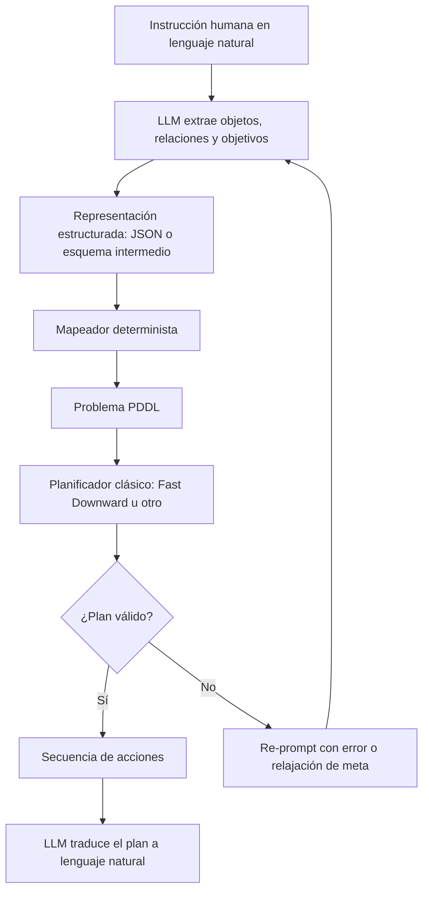
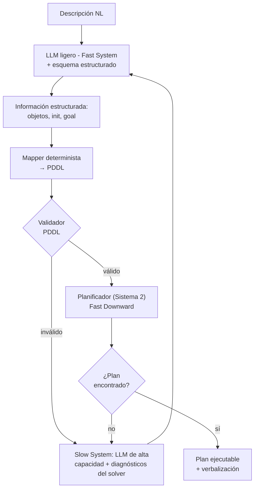
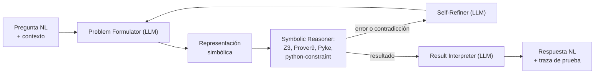
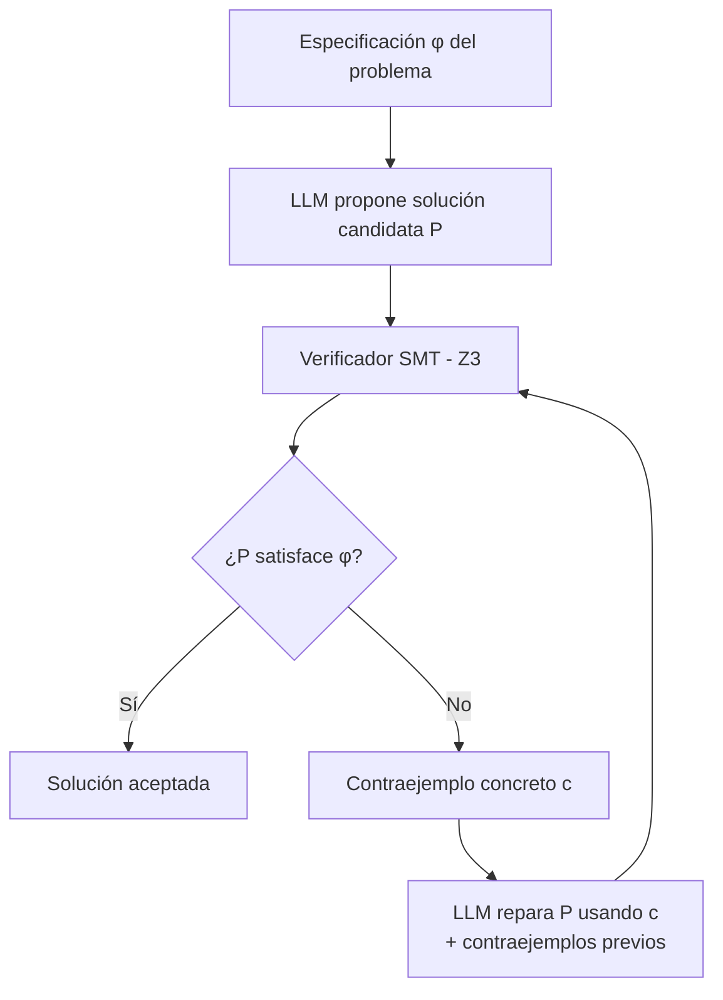
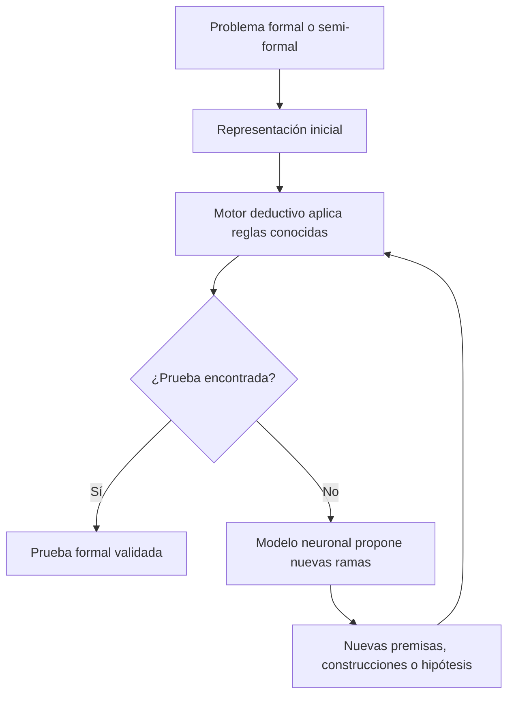
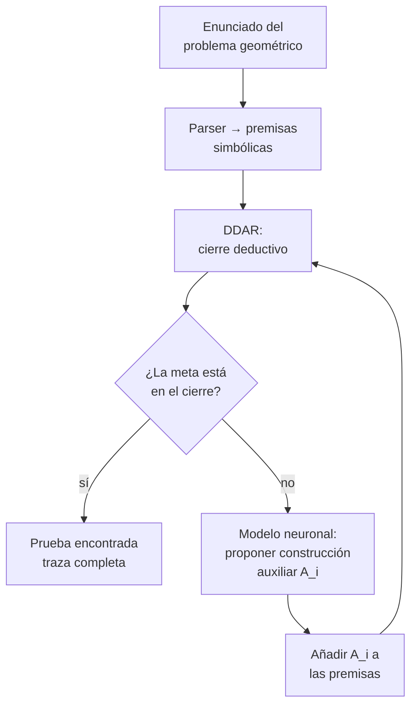
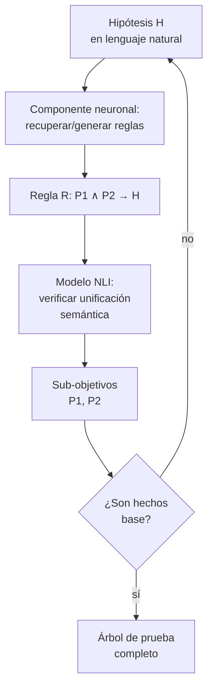
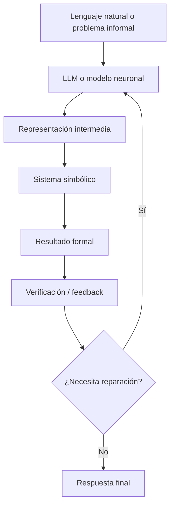

# IA Neurosimbólica y Grandes Modelos de Lenguaje: Arquitecturas, Casos de Uso y Fragilidad Estructural

> **Nota sobre referencias.** Este documento utiliza una **única bibliografía global** numerada al final. Todas las citas en el texto refieren a esa lista. Esta convención es deliberada: en versiones anteriores las secciones tenían bibliografías locales con numeración inconsistente (la cita `[7]` resolvía a papers distintos según la sección), un problema que esta revisión corrige.

---

## 1. Introducción a la IA Neurosimbólica (NeSy) y el Paradigma LLM

### 1.1. El Problema del *Symbol Grounding* y la Naturaleza del Razonamiento

Históricamente, el desarrollo de la Inteligencia Artificial ha estado dominado por dos paradigmas ortogonales: el conexionista (aprendizaje inductivo basado en datos) y el simbólico (razonamiento deductivo basado en reglas) [1, 2]. Los Grandes Modelos de Lenguaje (LLMs) encapsulan el estado del arte del paradigma conexionista, operando como arquitecturas probabilísticas masivas que sobresalen en el reconocimiento de patrones y la generalización sobre datos no estructurados, pero que son incapaces de proveer garantías formales sobre la veracidad de sus salidas.

En el extremo opuesto, la IA simbólica clásica ejecuta el razonamiento mediante motores deductivos estructurados (solucionadores SAT/SMT, planificadores PDDL o sistemas expertos), los cuales garantizan un comportamiento determinista, explicabilidad y seguridad matemáticamente verificable. Sin embargo, la computación simbólica sufre de un cuello de botella crítico en la adquisición de conocimiento: es intolerante al ruido y requiere una traducción manual exhaustiva de los entornos reales de alta dimensionalidad a representaciones formales rígidas.

A pesar de que técnicas de inyección de prompts como Chain-of-Thought inducen capacidades emergentes de razonamiento paso a paso en los LLMs [3], estos modelos siguen siendo cajas negras estocásticas que carecen de un mecanismo intrínseco para asegurar la fidelidad lógica de sus inferencias.

El problema del *Symbol Grounding*, formulado originalmente por Stevan Harnad en 1990, expone la imposibilidad de que un sistema computacional puramente formal adquiera semántica intrínseca basándose únicamente en la manipulación sintáctica de símbolos. En el contexto de los LLMs, este dilema persiste bajo una nueva forma: aunque los modelos proyectan secuencias de texto en espacios vectoriales de alta dimensionalidad capturando relaciones estadísticas ricas, estas representaciones latentes siguen "flotando" sin un anclaje causal a las leyes discretas, la ontología y la física del mundo real. Un LLM puede generar la demostración matemática correcta de un teorema porque ha modelado la distribución de probabilidad de textos matemáticos similares, no porque su arquitectura "comprenda" los axiomas subyacentes.

Como resultado, cuando un LLM es forzado a ejecutar tareas de razonamiento deductivo o planificación a largo plazo de manera aislada (*end-to-end*), exhibe una degradación severa manifestada en alucinaciones, deriva semántica y violaciones a restricciones lógicas [4]. Este fenómeno está empíricamente documentado: en el dominio Blocksworld de PlanBench, GPT-4 con *chain-of-thought* alcanza tasas de éxito de ~35% en problemas de horizonte medio, frente al ~97-100% que alcanzan planificadores clásicos como Fast Downward sobre la misma especificación PDDL [16].

La IA Neurosimbólica (NeSy) emerge no como un *ensemble* superficial, sino como una solución estructural a esta dicotomía [5]. El objetivo de diseño es construir una arquitectura híbrida que emule la cognición de sistema dual [6]: el procesamiento intuitivo y probabilístico (Sistema 1) del LLM, acoplado al procesamiento deliberativo y lógico (Sistema 2) del motor simbólico. El paradigma NeSy postula que la capacidad de razonamiento robusto no se alcanza simplemente escalando el número de parámetros del Sistema 1 (LLMs), sino construyendo topologías que integren formalmente ambos sistemas.

Al utilizar LLMs estrictamente como extractores de información semántica y traductores de lenguaje natural a un formalismo lógico (Lógica de Primer Orden, PDDL, SMT-LIB), y delegar el cálculo inferencial a un solucionador simbólico, las arquitecturas NeSy eliminan el cuello de botella de la adquisición de conocimiento sin sacrificar la trazabilidad matemática ni la transparencia del árbol de prueba final [22].

La barrera fundamental para orquestar la integración NeSy reside en la incompatibilidad estructural de sus representaciones de conocimiento. El paradigma conexionista de los LLMs utiliza representaciones continuas, distribuidas y sub-simbólicas (*embeddings*), donde el conocimiento es una propiedad emergente y holística de matrices de pesos opacas. Por el contrario, el paradigma simbólico exige representaciones discretas, localizadas y explícitas (grafos, árboles, reglas lógicas), donde cada nodo o símbolo tiene un significado semántico inmutable. La taxonomía de integración NeSy es, en el fondo, la clasificación de los diversos algoritmos de "traducción" diseñados para cruzar este abismo dimensional entre espacios métricos continuos y estructuras lógicas discretas.

---

### 1.2. Taxonomía Fundamental de la IA Neurosimbólica

Para estructurar algorítmicamente las arquitecturas de integración entre el aprendizaje estadístico y el razonamiento deductivo, este trabajo adopta la taxonomía de Kautz [7], la más extendida en la literatura reciente sobre LLMs. Conviene reconocer, sin embargo, que **no es la única clasificación disponible**: van Harmelen y ten Teije proponen una taxonomía centrada en la dirección del flujo, mientras que Hitzler y colaboradores [5] organizan los sistemas NeSy según el locus de la representación del conocimiento. Se elige Kautz aquí por su claridad pedagógica y por ser la referencia que mejor se mapea al ecosistema LLM contemporáneo.

> **Vídeo de referencia:** la conferencia magistral original donde Kautz popularizó este modelo es [The Third AI Summer (AAAI 2020 Robert S. Engelmore Memorial Award Lecture)](https://www.youtube.com/watch?v=_cQITY0SPiw).

El modelo clasifica los sistemas NeSy en seis topologías basadas en la direccionalidad del flujo de datos, el acoplamiento estructural y el mecanismo de inferencia.

**Tipo 1 — *Symbolic Neuro Symbolic*: Arquitectura de Entrada/Salida Discreta.** Es la lectura habitual de los LLMs *vanilla* en la literatura LLM-céntrica reciente. El sistema recibe secuencias de símbolos discretos (texto en lenguaje natural), emplea una red neuronal para proyectarlos en un espacio de *embeddings* continuos, procesa los patrones latentes y decodifica la salida nuevamente a símbolos discretos. Cabe matizar que la formulación original de Kautz contemplaba canónicamente sistemas como la traducción automática neural; la extensión a LLMs es una lectura posterior. Aunque el modelo genera secuencias que aparentan coherencia lógica, no existe un motor de razonamiento formal interno ni validación estructurada. La "lógica" es un subproducto estadístico del modelado de lenguaje.

**Tipo 2 — *Symbolic[Neuro]*: Subrutinas Neuronales en Motores Simbólicos.** La arquitectura es gobernada por un solver simbólico clásico (un planificador, un motor de búsqueda en árboles) que delega tareas intratables analíticamente a submódulos neuronales. El paralelo canónico es AlphaGo: MCTS guiado por una red neuronal de política/valor. **AlphaGeometry2** (Sección 3.3) es el ejemplo paradigmático en el ámbito de razonamiento formal: el motor simbólico DDAR conduce la búsqueda y la red neuronal funciona como heurística para proponer construcciones auxiliares.

**Tipo 3 — *Neuro ∪ Symbolic*: Sistemas Híbridos Acoplados Bidireccionalmente.** Bucle cooperativo donde los componentes estadísticos y deductivos interactúan dinámicamente. Una red neuronal computa distribuciones de probabilidad sobre hechos o premisas; estas predicciones probabilísticas se inyectan en un motor de inferencia lógico-probabilística como **DeepProbLog** [23], que computa la demostración lógica y, crucialmente, calcula el gradiente de pérdida basado en el éxito de la prueba, retropropagándolo hacia la red. La retropropagación a través de motores discretos requiere técnicas especializadas (relajación continua, *weighted model counting*) cuyo coste computacional limita severamente la escalabilidad a la dimensionalidad de un LLM moderno. En la práctica, los sistemas Tipo 3 se han demostrado con redes pequeñas, no con LLMs.

**Tipo 4 — *Neuro → Symbolic*: Pipeline en Cascada (Extracción hacia Deducción).** Es el paradigma dominante en la integración NeSy con LLMs en tiempo de inferencia. El LLM opera exclusivamente como un Extractor de Información o analizador semántico, compilando el lenguaje natural a una representación formal estricta (Lógica de Primer Orden, PDDL, SMT-LIB, SPARQL). Esta salida estructurada se pasa como input determinista a un solucionador simbólico externo. **LLM+P** [8] y **Logic-LM** [9] (Sección 3) son los exponentes más estudiados.

**Tipo 5 — *NeuroSYMBOLIC*: Compilación Lógica en la Función de Pérdida.** Esta topología integra el conocimiento deductivo durante el entrenamiento de la red, sin depender de solvers externos en tiempo de inferencia. Marcos como Logic Tensor Networks [10] y Logical Neural Networks [11] relajan funciones booleanas discretas hacia una lógica difusa diferenciable. Las reglas simbólicas se inyectan como restricciones suaves (*soft-constraints*) en la función de pérdida [12], penalizando topológicamente a la red durante el descenso del gradiente cuando sus predicciones violan axiomas predefinidos. Una implementación canónica es la *Semantic Loss* de Xu et al. [13], demostrada originalmente sobre clasificadores pequeños. Aplicar esta técnica a LLMs de miles de millones de parámetros sigue siendo, en la práctica, un problema abierto: ningún trabajo publicado hasta la fecha ha demostrado integración Tipo 5 a escala LLM con éxito *end-to-end*.

**Tipo 6 — *Neuro[Symbolic]*: Fusión Intrínseca de Razonamiento Combinatorio.** Representa el nivel máximo de integración teórica: un motor de pensamiento simbólico se incrusta estructuralmente en el tejido de la arquitectura neuronal, ejecutando razonamiento formal mediante cálculos tensoriales nativos. Es el equivalente algorítmico a la unificación perfecta de los Sistemas 1 y 2 de Kahneman. **Algunos autores clasifican aquí a las Logical Neural Networks** [11], dada su correspondencia 1-a-1 entre neuronas y fórmulas lógicas; otros las ubican en Tipo 5. Esta ambigüedad clasificatoria refleja que la frontera Tipo 5 / Tipo 6 está mal definida en la literatura. En cualquier caso, ningún LLM actual logra emular razonamiento combinatorio algorítmico de manera intrínseca y escalable, manteniendo el Tipo 6 como horizonte teórico abierto.

<p align="center">
  
</p>

<p align="center">
  <em>Figura 1.1: Taxonomía de Kautz aplicada a arquitecturas de IA neurosimbólica.</em>
</p>

---

### 1.3. Mapeo de los LLMs sobre la Taxonomía

En su arquitectura nativa, los LLMs se leen como sistemas Tipo 1 bajo la lectura LLM-céntrica de Kautz. Para dotarlos de capacidades deductivas y garantías de seguridad, la ingeniería actual los mapea a niveles superiores de integración mediante dos paradigmas ortogonales: la inyección de restricciones durante el entrenamiento y la orquestación modular en tiempo de inferencia.

#### Integración en el entrenamiento (Tipo 5)

Este enfoque prescinde de solvers externos en *runtime*. El conocimiento simbólico se compila directamente en los pesos de la red como restricciones suaves durante el entrenamiento [10, 11]. La *Semantic Loss* [13] formaliza esta intuición: el optimizador computa el *Weighted Model Counting* sobre la distribución de predicciones de la red, evaluando la probabilidad marginal de que la salida satisfaga un conjunto de fórmulas lógicas predefinidas; minimizar el logaritmo negativo de esa probabilidad fuerza a la red a converger en un espacio paramétrico coherente con las reglas del dominio.

Las dos limitaciones estructurales son: (i) computar la satisfacción de fórmulas lógicas sobre distribuciones marginales en cada iteración del *backpropagation* introduce un coste prohibitivo, y (ii) el método aproxima estadísticamente la lógica, sin proveer garantías deterministas en *runtime*. Como consecuencia práctica, **no existe a día de hoy una implementación Tipo 5 demostrada a escala de un LLM frontera**.

#### Integración en tiempo de inferencia (Tipos 2, 3 y 4)

El paradigma dominante en arquitecturas SOTA. Ejemplos centrales: Logic-LM [9] (Tipo 4 con bucle de auto-refinamiento), DUPLEX [14] (Tipo 4 con extracción guiada por esquema), LLM+P [8] (Tipo 4), AlphaGeometry2 [15] (Tipo 2). El pipeline general:

1. **Extracción de información y formulación.** El LLM, guiado por esquemas o ejemplos *in-context*, mapea entidades y relaciones a un lenguaje formal tipado (PDDL, SMT-LIB).
2. **Razonamiento simbólico.** Un motor determinista (Z3, Fast Downward, Prolog) ejecuta la inferencia formal sin intervención neuronal.
3. **Bucle de reflexión.** Si el solver detecta sintaxis malformada o irresolubilidad, el mensaje de error se reinyecta al LLM para regenerar la representación.

Este paradigma presenta una vulnerabilidad extrema en la capa de traducción: si el LLM omite una precondición implícita, alucina un predicado fuera del vocabulario o corrompe la sintaxis durante la extracción, la ejecución del solver colapsa. Combinado con la complejidad temporal de los solvers (a menudo NP-Hard o PSPACE), esto inhabilita estos pipelines para sistemas autónomos que requieran inferencia reactiva en tiempo real (Sección 4).

> **Vídeo ilustrativo:** [What Is NeuroSymbolic AI? Bridging Reasoning & Neural Networks (IBM Technology)](https://www.youtube.com/watch?v=ZfWDVO3rzeA).

---

## 2. Restricciones Estructurales de los LLMs

Esta sección documenta de manera empírica los modos de falla específicos del paradigma conexionista que motivan la integración simbólica. A diferencia de la Sección 1, que estableció el marco conceptual del *symbol grounding*, aquí se cuantifican las fallas con datos de *benchmarks* concretos.

### 2.1. Fallas estructurales de los modelos conexionistas puros

**Opacidad y ausencia de inferencia verificable.** Los LLMs operan como cajas negras donde el conocimiento se distribuye en pesos numéricos opacos [1, 16]. La opacidad combinada con la falta de inferencia verificable es prohibitiva en dominios críticos (medicina, derecho, finanzas).

**Alucinaciones.** Contenido sintácticamente correcto pero factualmente incorrecto. Surge de la codificación con pérdida de información y del fenómeno de *grounding* discutido en 1.1 [3].

**Falla en razonamiento multi-paso y planificación.** En PlanBench (Blocksworld), GPT-4 con *chain-of-thought* alcanza ~35% de éxito, frente a ~97-100% de un planificador clásico sobre la especificación PDDL equivalente. En problemas con horizonte mayor (>6 pasos) o con vocabulario ofuscado (acciones renombradas), el rendimiento de los LLMs *vanilla* cae aún más, lo que evidencia que la capacidad observada en problemas pequeños es en gran medida memorización superficial, no planificación composicional [4].

**Falla en deducción formal.** Los LLMs modernos se contradicen a sí mismos y fallan en aplicar correctamente *modus ponens*, *modus tollens* o consistencia ante la negación. En FOLIO, GPT-4 con CoT alcanza ~70-78% según configuración; con Logic-LM (Tipo 4) sube a ~78-79%; ambos lejos del 95%+ que producen los proof assistants sobre formalizaciones manuales correctas [9].

**Fragilidad sintáctica.** Cualquier error en el prompt o la omisión de un solo predicado por parte del LLM al generar lenguaje formal hace que todo el pipeline NeSy falle, ya que el modelo no comprende la semántica precisa del lenguaje formal que produce [5].

**Generalización composicional limitada.** Los LLMs reconocen patrones pero no extrapolan composicionalmente: pueden resolver instancias dentro de la distribución de entrenamiento y fallar sistemáticamente en variaciones estructuralmente equivalentes pero superficialmente distintas [16].

### 2.2. Ventajas de la arquitectura simbólica

Frente a estas fallas, los sistemas simbólicos operan bajo reglas lógicas estrictas que garantizan resultados consistentes:

- **Inferencia determinista y reproducible.** En motores como las Logical Neural Networks [11], cada elemento tiene correspondencia 1-a-1 con fórmulas lógicas; la convergencia es demostrable en un número finito de pasos.
- **Verificación formal.** Planificadores clásicos como Fast Downward permiten que verificadores externos comprueben matemáticamente las precondiciones, efectos y metas de cada acción.
- **Corrección por construcción mediante solvers.** Al incorporar solvers SMT (Z3) o intérpretes de código —como ocurre en PAL [17] y CEGIS [18]— el resultado deja de depender de la generación probabilística y queda respaldado por un mecanismo de ejecución formal.
- **Resolución óptima de problemas combinatorios.** AlphaGeometry2 [15] muestra que un motor simbólico puede resolver problemas IMO de geometría con un 84% de éxito (frente al 54% de AlphaGeometry y superando al medallista de oro promedio), sin introducir errores de cálculo.
- **Trazabilidad y auditabilidad.** Cada decisión está respaldada por un árbol de pruebas interpretable, propiedad indispensable para los dominios discutidos en la Sección 5.

---

## 3. Casos de Uso y Pipelines Algorítmicos

### 3.0. Idea central

Los sistemas NeSy-LLM combinan dos capacidades con límites bien documentados:

- Los **LLMs** son fuertes interpretando lenguaje natural, generando hipótesis y completando patrones, pero son probabilísticos y propensos a alucinaciones.
- Los **sistemas simbólicos** son fuertes ejecutando razonamiento formal verificable, pero requieren entradas formalizadas con precisión.

La hipótesis técnica es que el LLM **no debe ser** el componente que razona de extremo a extremo. En los pipelines modernos, el LLM funciona como una **interfaz semántica** entre el lenguaje humano y una representación formal; un componente simbólico ejecuta después el razonamiento.

| Subsección | Rol del componente neuronal | Componente simbólico | Mecanismo de control |
|---|---|---|---|
| 3.1 | Extractor de información (IE) guiado por esquema | Planificador clásico (Fast Downward) | Validación sintáctica del PDDL |
| 3.2 | Formulador / traductor a lógica formal | Solver SAT/SMT (Z3, Prover9) | Bucle de auto-refinamiento por error o contraejemplo |
| 3.3 | Heurística generativa | Motor deductivo (DDAR, Prolog-like) | Cierre deductivo o *backward chaining* |

Estructura común:


El éxito depende de la **calidad de la traducción neurosimbólica**: si el LLM traduce mal la tarea, el solver puede fallar aunque el razonamiento simbólico sea correcto. Confundir el rol del LLM (usarlo como *planificador* en lugar de como *formalizador*) es precisamente la falla que estas arquitecturas buscan corregir [16].

---

### 3.1. Planificación Robótica y Extracción de Información: LLM+P y DUPLEX

#### 3.1.1. Problema

En tareas de planificación, el usuario puede pedir algo en lenguaje natural:

> "Lleva el bloque rojo a la mesa, después mueve el bloque azul al estante y asegúrate de que el robot no choque con ningún obstáculo."

LLM+P [8] reporta que GPT-4 *vanilla* falla en producir planes ejecutables en la mayoría de los 7 dominios IPC evaluados (Blocksworld, Termes, Floortile, Tyreworld, Grippers, Storage, Barman), mientras que LLM+P (LLM como formalizador + Fast Downward como planificador) alcanza tasas de éxito sustancialmente más altas, en muchos casos cercanas al 100%. Tendencias similares han sido reportadas en PlanBench [16], confirmando que los LLMs por sí solos no resuelven planificación de horizonte largo: aproximan textualmente la distribución de planes plausibles, sin garantías de satisfacibilidad ni optimalidad.

PDDL (*Planning Domain Definition Language*) permite representar objetos, estado inicial, estado objetivo y acciones con precondiciones y efectos. Tanto **LLM+P** [8] como **DUPLEX** [14] resuelven la asimetría entre lenguaje natural y PDDL empleando al LLM como interfaz de formalización y delegando la búsqueda al planificador.

#### 3.1.2. Pipeline general



#### 3.1.3. LLM+P [8]: traducción directa NL → PDDL

LLM+P propone un pipeline de cuatro etapas:

1. **Ingesta.** Se asume un dominio PDDL pre-especificado. El usuario aporta únicamente el *problem file* en lenguaje natural.
2. **Formalización por *in-context learning*.** Prompt con (a) el dominio PDDL, (b) un único ejemplo `(descripción-NL, problem-PDDL)` y (c) la nueva descripción a formalizar. El LLM completa los bloques `(:objects ...)`, `(:init ...)` y `(:goal ...)`.
3. **Planificación.** Fast Downward sobre el par (dominio, problema). Devuelve un plan válido —posiblemente óptimo según configuración— o reporta fallo.
4. **Verbalización.** El LLM traduce la secuencia de acciones simbólicas a lenguaje natural.

**Observación crítica.** Las mejoras reportadas se obtienen **asumiendo que el dominio PDDL ya existe**. Generar también el dominio (no solo la instancia) queda fuera del alcance, lo que hace a LLM+P brillante en entornos cerrados y frágil en escenarios abiertos [8].

#### 3.1.4. DUPLEX [14]: doble sistema con IE guiada por esquema

DUPLEX (Hua et al., 2026) generaliza LLM+P en dos direcciones [14]:

**(a) Marco *dual-process*.** DUPLEX se inspira explícitamente en la dicotomía Sistema 1 / Sistema 2. El **Fast System** es un LLM ligero que extrae información estructurada en un solo *forward pass*; el **Slow System** se activa exclusivamente cuando el planificador falla, e invoca un LLM de mayor capacidad para reflexión iterativa y reparación, alimentado por los diagnósticos del solver.

**(b) *Schema-Guided Information Extraction*.** Es la contribución central. El LLM no genera código ni texto PDDL libre: recibe un *prompt* con un esquema fijo (objetos, sus tipos, predicados unarios y binarios verdaderos en el estado inicial, condiciones de meta) y rellena la estructura. La traducción a PDDL la realiza un *mapper* **determinista** preimplementado, eliminando una clase entera de alucinaciones sintácticas. La idea de fondo: reducir la "compleja tarea de planificación o generación de código a un problema clásico de NLP (extracción de información), que es significativamente más simple y adecuado para LLMs" [14].



DUPLEX reporta evaluación sobre 12 dominios clásicos y domésticos de planificación, superando a *baselines end-to-end* e híbridos previos en tasa de éxito y fiabilidad [14]. La conclusión central de los autores resume el paradigma: la clave no es hacer que el LLM planifique mejor, sino restringirlo a la parte donde es bueno —*structured semantic grounding*— y dejar la síntesis lógica del plan al planificador simbólico.

#### 3.1.5. Ejemplo trabajado

Tarea: *"El robot debe mover la caja A desde la habitación 1 hasta la habitación 2."*

El LLM, restringido al esquema, produce:

```json
{
  "objects": ["robot", "box_A", "room_1", "room_2"],
  "initial_state": [
    "robot_at(room_1)",
    "box_at(box_A, room_1)"
  ],
  "goal_state": [
    "box_at(box_A, room_2)"
  ]
}
```

El *mapper* determinista convierte esto a PDDL. El planificador devuelve:

```text
1. pick_up(robot, box_A, room_1)
2. move(robot, room_1, room_2)
3. drop(robot, box_A, room_2)
```

Verbalización: *"El robot recoge la caja A en la habitación 1, se desplaza a la habitación 2 y la deposita allí."*

El valor del sistema **no** está en que el LLM imagine la respuesta, sino en que el plan final fue generado por un componente simbólico que verifica precondiciones y efectos.

#### 3.1.6. Comparación

| Sistema | Rol del LLM | Riesgo principal | Mitigación arquitectónica |
|---|---|---|---|
| **LLM+P** [8] | Traduce NL → PDDL en una pasada. | Errores de sintaxis PDDL; predicados inventados. | *Few-shot* con un único ejemplo del dominio. |
| **DUPLEX** [14] | Rellena un esquema; el *mapper* traduce a PDDL. | Omisiones semánticas; objetos faltantes. | Extracción guiada por esquema + *mapper* determinista + *Slow System* reflexivo. |

**LLM-Modulo** [19] propone una generalización de este patrón con verificación externa explícita y bucles de aprobación; es la referencia teórica que explica por qué LLM+P y DUPLEX tienen éxito allí donde LLMs *vanilla* fallan.

#### 3.1.7. Evaluación crítica

Estos sistemas usan al LLM donde es fuerte (comprensión semántica flexible) y al planificador donde es fuerte (búsqueda formal). El cuello de botella es la interfaz entre ambos. Si el LLM extrae mal los objetos, omite restricciones o genera una estructura incompleta, el planificador resolverá un problema distinto al que el usuario quería —produciendo un plan formalmente válido pero **semánticamente equivocado**.

**Lección principal:** la integración NeSy no elimina los errores de los LLMs; los **desplaza hacia la fase de traducción**.

---

### 3.2. Solucionadores SAT/SMT y Lógica de Primer Orden: Logic-LM y CEGIS

#### 3.2.1. Problema

A diferencia de la planificación —donde el output es una *secuencia* de acciones—, el razonamiento lógico requiere verificar la *consistencia* de un conjunto de proposiciones. Los LLMs fallan en consistencia estricta, manejo de cuantificadores, inferencia multi-paso y verificación de restricciones. La solución NeSy: traducir el problema a una representación formal y delegar la inferencia a un **solver lógico** especializado.

#### 3.2.2. Logic-LM [9]: pipeline triádico con auto-refinamiento

Logic-LM introduce una arquitectura modular de tres componentes más un **Self-Refiner**:



**Pasos:**

1. **Selección de formalismo.** Logic-LM soporta cuatro: First-Order Logic (Prover9), Constraint Satisfaction (python-constraint), SAT (Z3 proposicional) y Logic Programming (Pyke).
2. **Formalización *in-context*.** El LLM produce la representación simbólica con ejemplos *few-shot*.
3. **Ejecución determinista.** El solver se ejecuta. Si la formalización es sintácticamente inválida, el parser devuelve un error; si es lógicamente inconsistente, el solver devuelve un resultado o mensaje que sirve como señal de feedback.
4. **Self-Refinement.** El error o salida se reenvían al LLM con un *prompt* del tipo: *"La formulación previa produjo el error X. Identifica la premisa errónea y reescribe la formulación."*
5. **Interpretación.** Si hay éxito, el LLM verbaliza la conclusión y la traza de prueba.

**Resultados empíricos.** Logic-LM con GPT-4 alcanza ~78.9% en FOLIO y ~83% en ProofWriter, frente al ~70% de GPT-4 con CoT puro [9]. El bucle de Self-Refinement contribuye con una fracción significativa de esa ganancia (~5-8 puntos porcentuales según *ablation*) [9, 20], lo que cuantifica empíricamente la magnitud del problema de fragilidad de traducción discutido en la Sección 4.

#### 3.2.3. Ejemplo trabajado

> "Todos los médicos son profesionales. Ana es médica. ¿Ana es profesional?"

El LLM produce:

```text
∀x. Doctor(x) → Professional(x)
Doctor(Ana)
query: Professional(Ana)
```

Prover9 verifica la conclusión. Resultado formal: `Professional(Ana)` es verdadero.

Verbalización: *"Sí. Como todos los médicos son profesionales y Ana es médica, entonces Ana es profesional."*

El razonamiento final no depende de la intuición probabilística del LLM, sino de validación lógica externa.

#### 3.2.4. Self-Refinement: bucle de reparación

Cuando el solver detecta un error:

```text
Z3 error: unknown predicate Profesional(x)
```

Re-prompt:

```text
La fórmula anterior falló porque usaste el predicado Profesional(x),
pero el esquema permitido solo contiene Professional(x).
Reescribe la fórmula usando únicamente los predicados válidos.
```

El sistema corrige errores sin intervención humana. Desventajas: aumenta la latencia y **no garantiza convergencia**; el LLM puede reparar un error e introducir otro.

#### 3.2.5. CEGIS [18]: síntesis inductiva guiada por contraejemplo

**CEGIS** (*Counterexample-Guided Inductive Synthesis*) es un esquema clásico de síntesis de programas formalizado por Solar-Lezama. Jha et al. [18] lo acoplan a un LLM para obtener un sintetizador de programas verificables.



**Bucle algorítmico:**

```text
Entrada: especificación φ (en SMT-LIB o como pre/postcondiciones)
Estado:  conjunto C de contraejemplos, inicialmente vacío

repetir:
    1. Síntesis (LLM):
       prompt = φ + "Programas previos rechazados por estos contraejemplos: " + C
       P ← LLM(prompt)
    2. Verificación (Z3):
       consulta ← ¬(∀x. P(x) satisface φ)
       si Z3(consulta) = UNSAT:
           retornar P  # programa verificado
       si Z3(consulta) = SAT:
           c ← modelo de Z3  # contraejemplo concreto
           C ← C ∪ {c}
hasta convergencia o timeout
```

**Punto técnico clave.** Lo crucial es que el LLM **no necesita producir un programa correcto en un solo intento**: produce candidatos, y el solver actúa como oráculo de rechazo *con prueba constructiva*. Cada contraejemplo `c` es un **input concreto** que falsifica el candidato, lo que constituye una señal de retroalimentación mucho más rica que un error genérico. En la práctica, el espacio de búsqueda colapsa rápidamente.

#### 3.2.6. Logic-LM vs CEGIS: la densidad de la señal de feedback

La diferencia más importante entre ambos no es el solver, sino **la naturaleza del feedback**:

| Aspecto | Logic-LM | CEGIS |
|---|---|---|
| Tipo de error que reinyecta | Mensajes de error del parser o salidas del solver. | **Modelo concreto** (asignación de variables) que falsifica el candidato. |
| Densidad de la señal | Baja: el LLM debe inferir qué premisa cambiar. | Alta: el contraejemplo ancla la próxima iteración. |
| Convergencia típica | Variable; puede oscilar. | Convergencia rápida en pocas iteraciones. |
| Requisito sobre el problema | Formalizable en uno de los formalismos soportados. | Especificación φ formalizable manualmente. |

CEGIS converge más rápido en dominios donde φ es expresable: cada iteración elimina una región concreta del espacio de candidatos, mientras que Logic-LM debe inferir indirectamente qué premisa modificar.

#### 3.2.7. Evaluación crítica

La integración con SAT/SMT mejora claramente el razonamiento generativo: detecta inconsistencias, valida inferencias y produce respuestas más fieles a una especificación. Sin embargo, persisten tres problemas:

1. **Error de formalización.** Si el LLM traduce mal el problema, el solver resolverá una versión equivocada.
2. **Dependencia del esquema.** Predicados, tipos y restricciones deben estar bien definidos a priori.
3. **Coste de iteración.** Cada ciclo requiere nuevas llamadas al LLM y al solver.

Logic-LM y CEGIS no convierten al LLM en un razonador formal puro: lo convierten en un **generador y reparador de representaciones** verificadas externamente.

---

### 3.3. Sistemas Expertos Neuronales y Búsqueda de Pruebas: AlphaGeometry2 y NELLIE

#### 3.3.1. Problema

En geometría olímpica o razonamiento composicional sobre lenguaje científico, no basta con producir una respuesta final: el sistema debe generar una **prueba** —una cadena de inferencias formalmente auditable.

Las dos familias anteriores usan el LLM principalmente como **formalizador**: convierte lenguaje natural en PDDL, FOL, SMT o código, y un solver externo realiza la inferencia. En esta tercera familia el patrón cambia: el sistema simbólico conserva el control de la búsqueda, pero un componente neuronal propone ramas, reglas o construcciones cuando la deducción se bloquea.

En términos de la taxonomía de Kautz, AlphaGeometry2 **no es un pipeline `Neuro → Symbolic`**, sino un caso paradigmático del **Tipo 2 (`Symbolic[Neuro]`)**: el motor simbólico gobierna el proceso y llama al modelo neuronal como subrutina heurística. El paralelo conceptual es AlphaGo/AlphaZero (MCTS + red neuronal), trasladado del juego al dominio de la demostración geométrica.



#### 3.3.2. AlphaGeometry2 [15]: Tipo 2 `Symbolic[Neuro]`

AlphaGeometry y su sucesor AlphaGeometry2 alcanzaron rendimiento de medalla de oro en geometría olímpica, **resolviendo 84% de los problemas IMO 2000-2024 (42 de 50)**, frente al 54% de AlphaGeometry original [15, 21]. La prueba no la produce el modelo neuronal: la produce y valida el motor deductivo. El modelo solo sugiere construcciones auxiliares.

**Componentes:**

- **DDAR (*Deductive Database Arithmetic Reasoning*).** Motor simbólico que, dado un conjunto de premisas geométricas, cierra deductivamente todas las consecuencias derivables vía un conjunto fijo de reglas (*forward chaining*). Es completo dentro de su fragmento, pero **insuficiente** para problemas no triviales: muchas pruebas olímpicas requieren **construcciones auxiliares** —puntos, líneas o círculos no presentes en el enunciado.
- **Modelo de lenguaje heurístico.** En el sistema original [21], un transformer entrenado *desde cero* sobre una base masiva de teoremas sintéticos generados por el propio DDAR. AlphaGeometry2 [15] sustituye ese transformer por **Gemini *fine-tuneado*** y mejora la coordinación entre árboles de búsqueda. **Importante:** este modelo no es un LLM conversacional generalista, sino un modelo especializado.

**Pipeline algorítmico:**



**Pasos:**

1. **Parseo.** El enunciado se traduce a proposiciones en el lenguaje formal de DDAR (determinista, sin LLM).
2. **Cierre deductivo inicial.** DDAR aplica todas las reglas hasta saturación. Si la meta aparece en el cierre, la prueba termina.
3. **Proposición heurística.** Si no, el modelo neuronal examina el estado actual y propone una construcción auxiliar (p. ej., *"sea M el punto medio de AB"*).
4. **Iteración.** La construcción se añade a las premisas y DDAR se re-ejecuta. El bucle continúa hasta encontrar la prueba o agotar el presupuesto.

**Patrón arquitectónico clave.** El modelo neuronal **nunca afirma** que la prueba es válida; esa responsabilidad recae 100% en DDAR. El componente neuronal es estrictamente un **proponente de ramificaciones** en un árbol de búsqueda cuyas hojas son verificadas por el motor simbólico. Esta separación —**generación neuronal, verificación simbólica**— es lo que ubica a AlphaGeometry2 en el Tipo 2 de Kautz.

AG2 mejora sobre AG1 [21] con: (i) un lenguaje de dominio extendido (objetos en movimiento, ecuaciones lineales de ángulos/razones/distancias, teoremas tipo *locus*, problemas no constructivos), elevando la cobertura del lenguaje sobre IMO 2000-2024 del 66% al 88%; (ii) un solver simbólico reescrito en C++, dos órdenes de magnitud más rápido; (iii) un mecanismo de *knowledge sharing* entre múltiples árboles de búsqueda.

#### 3.3.3. NELLIE [22]: backward chaining neuro-simbólico

NELLIE aborda razonamiento composicional sobre lenguaje natural científico (p. ej., *"¿Por qué hierve el agua a 100°C al nivel del mar?"*). En lugar de cierre deductivo *forward*, usa **backward chaining** estilo Prolog.

**Idea clave.** Dada una hipótesis H a probar, NELLIE busca recursivamente reglas R cuyo consecuente unifique con H, y entonces intenta probar los antecedentes. La búsqueda imita SLD-resolution. **La novedad: los átomos no son símbolos sintácticos, son frases en lenguaje natural**, y el componente neuronal realiza tres funciones:

1. **Recuperación de reglas.** *Dense retrieval* o generación propone reglas relevantes desde un corpus.
2. **Unificación semántica.** En lugar de unificación sintáctica (Prolog), un modelo NLI evalúa si dos frases son *entailment-equivalentes*.
3. **Generación de reglas.** Si ninguna regla del corpus aplica, el componente neuronal *genera* una candidata, verificada por consistencia.



**Resultado.** NELLIE construye **árboles de prueba explícitos** —no cadenas opacas de *chain-of-thought*— sobre EntailmentBank y otros benchmarks de QA científico. El árbol es auditable, propiedad que la Sección 5.2 requerirá para dominios de alto riesgo.

#### 3.3.4. Evaluación crítica

AlphaGeometry2 y NELLIE representan integración más profunda que los pipelines de traducción simple: el componente neuronal participa activamente en la exploración del espacio de soluciones. En AG2 esta integración es taxonómicamente limpia: el sistema simbólico manda y la red funciona como subrutina heurística (Tipo 2). En NELLIE el encaje es menos rígido, porque la búsqueda tipo Prolog depende de recuperación, generación y unificación semántica sobre lenguaje natural.

El riesgo principal es el **coste de búsqueda**. En dominios complejos, el número de ramas, submetas o construcciones auxiliares crece de forma explosiva. La ventaja: cuando funciona, el resultado queda respaldado por una cadena de inferencia simbólica.

**Trade-off entre soundness y generalidad:** AG2 es extremadamente *sound* pero opera solo en geometría euclidiana; NELLIE es más general pero su unificación semántica vía NLI introduce ruido que el motor de Prolog clásico no tendría.

---

### 3.4. Síntesis comparativa: tabla de rendimiento empírico

| Sistema | Benchmark | LLM-only (CoT) | NeSy | Mejora |
|---|---|---|---|---|
| LLM+P [8] | IPC-7 dominios (Blocksworld, Termes, etc.) | ~10-30% | ~80-100% (varía por dominio) | +50-70 pp |
| Logic-LM [9] | FOLIO (GPT-4) | ~70.6% | ~78.9% | +8.3 pp |
| Logic-LM [9] | ProofWriter (GPT-4) | ~76% | ~83% | +7 pp |
| LINC [24] | ProofWriter (GPT-4) | ~58% | ~84% | +26 pp |
| AlphaGeometry2 [15] | IMO Geometry 2000-2024 | — (inviable) | 84% (42/50) | — |
| AlphaGeometry → AG2 [15, 21] | IMO Geometry 2000-2024 | — | 54% → 84% | +30 pp |

Los números provienen de los papers originales; algunas configuraciones varían por modelo base, número de ejemplos *few-shot* y *fallback* aplicado. La tabla ilustra el orden de magnitud de la mejora, no comparaciones controladas estrictas.

#### Matriz funcional

Los sistemas analizados pueden organizarse en una matriz que cruza **rol del componente neuronal** × **régimen de control simbólico**. Es una clasificación funcional complementaria, no sustitutiva, de la taxonomía de Kautz. AG2, por ejemplo, aparece aquí en la celda de "heurística", pero taxonómicamente es Tipo 2 (`Symbolic[Neuro]`).

| | **Búsqueda determinista sobre representación formalizada** | **Búsqueda guiada por heurística aprendida** |
|---|---|---|
| **LLM como formalizador** | LLM+P, DUPLEX (NL → PDDL → A\*) <br> Logic-LM (NL → FOL/SMT → solver) | CEGIS (candidatos generados + verificación SMT iterativa) |
| **Modelo neuronal como heurística** | — | AlphaGeometry2 (DDAR + construcciones auxiliares) <br> NELLIE (Prolog-style + retrieval semántico) |

| Familia | Ejemplos | Rol del componente neuronal | Rol simbólico | Fortaleza | Fragilidad principal |
|---|---|---|---|---|---|
| Planificación | LLM+P, DUPLEX | Extraer/estructurar bajo esquema | Generar planes verificables | Planes ejecutables y validados | Mala traducción de objetos, acciones o metas |
| Lógica formal | Logic-LM, CEGIS | Formular y reparar usando feedback del solver | Validar fórmulas, dar contraejemplos | Corrección lógica fuerte | Error de formalización inicial; oscilación en refinamiento |
| Búsqueda de pruebas | AG2, NELLIE | Proponer ramas, hipótesis o construcciones | Deducir, verificar y cerrar pruebas | Explicabilidad y trazabilidad | Explosión combinatoria; dependencia del lenguaje admitido |

---

### 3.5. Patrón arquitectónico común



El invariante:

> **El componente neuronal interpreta, traduce o propone; el sistema simbólico verifica, planifica o deduce.**

La promesa de la IA neurosimbólica con LLMs no es hacer que el modelo neuronal sea perfecto; es diseñar una arquitectura donde sus errores puedan ser **detectados, corregidos o limitados** por componentes formales externos.

---

### 3.6. Cierre y transición a Sección 4

Tres observaciones cierran esta sección:

1. **Todos los sistemas pagan un coste de invocación al solver no trivial.** En AG2, cada construcción dispara un cierre deductivo completo; en CEGIS, cada candidato se verifica con Z3; en LLM+P, el planificador se ejecuta con coste exponencial en el peor caso. La latencia acumulada se discute en 4.1.
2. **La interfaz neuronal-simbólica es el eslabón débil universal.** En LLM+P, una alucinación en `(:init ...)` invalida el plan; en Logic-LM, una cuantificación errónea cambia el resultado deductivo; en AG2, una construcción mal formada o fuera del lenguaje geométrico no extiende correctamente el cierre de DDAR.
3. **La soundness se compra con generalidad.** Cuanto más estricto es el componente simbólico (Z3 > Fast Downward > DDAR > NLI semántico de NELLIE), más estrecho el dominio. NELLIE es el más general y menos *sound*; AG2 el más *sound* y menos transferible.

El punto vulnerable sigue siendo el **symbol grounding**: la conexión entre las palabras del usuario y los símbolos que manipula el sistema formal. El futuro depende menos de "añadir un solver" y más de **diseñar interfaces robustas** entre lenguaje natural, representaciones estructuradas y razonamiento formal.

---

## 4. Análisis Crítico: Cuellos de Botella y Fragilidad del Sistema

### 4.1. Latencia y cuellos de botella computacionales

Los pipelines NeSy-LLM no generan respuestas en una sola pasada. Requieren llamadas repetidas a solvers lógicos externos en cada iteración del bucle de *Self-Refinement*, donde los errores se reinyectan como nuevos *prompts* al LLM [8, 9]. El resultado es una latencia acumulativa que limita el uso en aplicaciones reactivas.

| Sistema | Estrategia de integración | Llamadas al solver | Latencia típica end-to-end | Viabilidad en tiempo real |
|---|---|---|---|---|
| LLM puro (CoT) | Ninguna | 0 | ~1-5 s | ✓ Alta |
| Logic-LM [9] | Inferencia + Self-Refinement | 1–N (iterativo) | ~10-60 s | ✗ Baja |
| LLM+P [8] | Planificador clásico offline | 1 (batch) | ~5-30 s + cómputo del planner | ~ Media (offline) |
| DUPLEX [14] | IE + PDDL + planificador (+ Slow System) | 1–3 | ~10-90 s | ~ Media |
| AlphaGeometry2 [15] | DDAR + búsqueda de prueba con construcciones | N (árbol profundo) | minutos a horas por problema | ✗ Muy baja |

Las cifras de latencia son aproximadas y dependen del modelo base, hardware del solver y dificultad de la instancia. En AG2, el cómputo se distribuye en TPUs y en su solver C++ optimizado; en problemas IMO difíciles, una sola búsqueda puede ocupar varios minutos incluso con la implementación reescrita [15].

Este patrón confina los sistemas NeSy-LLM, en la práctica, a procesamiento por lotes, generación de pruebas matemáticas o planificación robótica *offline* —dominios donde la latencia no es crítica. Técnicas de caché simbólico y compilación parcial son áreas activas de investigación, pero no resuelven el problema en dominios dinámicos.

---

### 4.2. Fragilidad de traducción

El cuello de botella más profundo no es la velocidad, sino la fiabilidad de la interfaz de traducción. Al convertir lenguaje natural a representaciones formales —FOL, PDDL, SMT— el LLM puede generar fórmulas sintácticamente inválidas, predicados inventados (*hallucinated predicates*) o inconsistencias semánticas que el solver no puede resolver [3, 9].

La consecuencia es estructural: **una traducción inicial incorrecta destruye por completo el flujo de inferencia simbólica subsecuente**. Los solvers operan sobre representaciones formalmente correctas; si el input es malformado, el sistema no puede producir ningún resultado útil, con independencia de la calidad de los pasos posteriores.


El mecanismo de **Self-Refinement** —presente en Logic-LM [9], CEGIS [18], DUPLEX [14]— mitiga parcialmente este problema reinyectando los mensajes de error como nuevos *prompts*. Sin embargo, este bucle:

- Puede no converger.
- Puede corregir un error superficial introduciendo otro semántico más profundo.
- Depende de *prompts* ultra-específicos con numerosos ejemplos *few-shot*, lo que dificulta la generalización a dominios nuevos.

Una línea complementaria es la **decodificación restringida por gramática** (Outlines, GBNF, JSON Schema) [25], que fuerza al LLM a generar salidas sintácticamente válidas por construcción. Esta técnica resuelve el problema sintáctico pero no el semántico: un LLM que es forzado a generar PDDL bien formado puede aún producir un PDDL bien formado y semánticamente equivocado. La fragilidad de traducción semántica permanece.

Mientras el componente neuronal siga siendo propenso a alucinaciones estructurales, la integración con componentes simbólicos deterministas no puede garantizar la fiabilidad *end-to-end* del pipeline [3].

---

## 5. Cuestiones Éticas, Sesgos y Retos Futuros

La integración NeSy responde no solo a una búsqueda de rendimiento sino a una necesidad de transparencia y responsabilidad frente a las limitaciones éticas de los modelos puramente estadísticos. Sin embargo, no elimina los problemas éticos: los redistribuye y, en ciertos casos, los complejiza.

### 5.1. Doble origen del sesgo y el riesgo de *explainability laundering*

Los sistemas NeSy enfrentan una dualidad de sesgo con orígenes diferenciados:

- **Sesgos sub-simbólicos.** Emergen de las distribuciones estadísticas en los datos de entrenamiento; la red los codifica como patrones probabilísticos opacos.
- **Sesgos simbólicos.** Provienen de reglas y ontologías definidas por humanos que pueden estar pre-sesgadas desde su concepción y que, al estar formalizadas, se propagan con plena certeza lógica.

El punto crítico es que **ambas dimensiones se componen en la interfaz de integración**. Un hecho extraído mediante percepción neuronal sesgada se convierte en premisa del razonador simbólico, que lo trata como verdad formal. El resultado es una falsa sensación de rigor: el sistema produce árboles de prueba lógicamente válidos sobre fundamentos contaminados.

Este efecto —llamémoslo **explainability laundering**— es la patología ética más distintiva de los sistemas NeSy. Un caso ilustrativo: imagínese un sistema NeSy de triage médico desplegado en un hospital. El componente neuronal extrae del historial clínico el predicado `non_compliant_patient(P)` basándose en patrones textuales del registro electrónico —patrones que en EE.UU. están documentadamente correlacionados con raza, idioma materno y código postal del paciente [26]. Una vez extraído, el predicado entra como premisa formal en el razonador simbólico, que aplica reglas del tipo:

```
∀P. non_compliant_patient(P) ∧ requires_long_treatment(P) → deprioritize(P)
```

La salida del sistema es un árbol de prueba impecable, auditable, defendible ante un comité hospitalario: *"el paciente fue despriorizado porque la regla R7 se aplicó a las premisas extraídas P12 y P34, ambas verdaderas"*. La inferencia simbólica es correcta; las premisas son sesgadas; el output es indistinguible de una decisión éticamente fundada. **La estructura formal del sistema confiere a la decisión una legitimidad institucional que no merece**, precisamente porque parece explicable.

Patrones análogos aplican en sentencing algorítmico (extracción de "riesgo de reincidencia" desde texto policial sesgado), aprobación de créditos (extracción de "estabilidad financiera" desde redes sociales) y elegibilidad migratoria. En todos estos casos, la apariencia de rigor formal puede dificultar más, no menos, el desafío legal o auditor de la decisión.

Marcos como las LNN [11] abordan parcialmente este problema mediante salvaguardas matemáticas que detectan contradicciones antes de que se propaguen, pero la calidad de los datos de entrenamiento del extractor neuronal y la neutralidad de las reglas siguen siendo responsabilidades externas al formalismo técnico.

---

### 5.2. Responsabilidad (*Accountability*) y Transparencia

En dominios de alto riesgo como medicina o derecho, la opacidad de la caja negra neural es inaceptable. La integración NeSy transforma la transparencia de una interpretación *post-hoc* a una propiedad nativa de la arquitectura: cada decisión puede rastrearse a través de las fórmulas lógicas que la produjeron.

Sin embargo, esta explicabilidad es **parcial por construcción**. Los árboles de prueba son trazables en su dimensión simbólica, pero sus premisas provienen del componente neuronal, que permanece relativamente opaco. Esto genera una brecha en la *accountability* causal: cuando el sistema comete un error, no siempre es posible determinar si la falla residió en la percepción, en las reglas o en la arquitectura de integración.

Arquitecturas como DUPLEX [14] mitigan este problema restringiendo el componente neural a la extracción de información estructurada bajo esquemas explícitos, delegando la validación lógica al planificador, e incorporando ciclos de autocorrección cuando se detectan inconsistencias. La intuición de diseño —**confinar al componente neural a la parte donde es bueno y dejar la inferencia formal a un sistema verificable**— es la dirección correcta, aunque insuficiente sin auditorías independientes sobre los datos y esquemas.

En síntesis: la integración neurosimbólica representa un avance real hacia una IA auditable y responsable. Pero la equidad de los datos, la neutralidad de las reglas y la delimitación ética de los dominios de aplicación permanecen como **obligaciones institucionales** que ninguna arquitectura técnica puede sustituir.

---

## Bibliografía

[1] W. Wang, Y. Yang, and F. Wu, "Towards Data-And Knowledge-Driven AI: A Survey on Neuro-Symbolic Computing," *IEEE Transactions on Pattern Analysis and Machine Intelligence*, vol. 47, no. 2, pp. 878–899, 2025.

[2] B. P. Bhuyan, A. Ramdane-Cherif, R. Tomar, and T. P. Singh, "Neuro-symbolic artificial intelligence: a survey," *Neural Computing and Applications*, vol. 36, pp. 12809–12844, 2024.

[3] A. Patil and A. Jadon, "Advancing Reasoning in Large Language Models: Promising Methods and Approaches," arXiv:2502.03671, 2025.

[4] M. Fang, S. Deng, Y. Zhang, Z. Shi, L. Chen, M. Pechenizkiy, and J. Wang, "Large Language Models Are Neurosymbolic Reasoners," 2024.

[5] M. K. Sarker, L. Zhou, A. Eberhart, and P. Hitzler, "Neuro-Symbolic Artificial Intelligence: Current Trends," 2021.

[6] D. Kahneman, *Thinking, Fast and Slow*. Farrar, Straus and Giroux, 2011.

[7] H. Kautz, "The Third AI Summer: AAAI Robert S. Engelmore Memorial Lecture," *AI Magazine*, 2022.

[8] B. Liu, Y. Jiang, X. Zhang, Q. Liu, S. Zhang, J. Biswas, and P. Stone, "LLM+P: Empowering Large Language Models with Optimal Planning Proficiency," arXiv:2304.11477, 2023.

[9] L. Pan, A. Albalak, X. Wang, and W. Y. Wang, "Logic-LM: Empowering Large Language Models with Symbolic Solvers for Faithful Logical Reasoning," in *Findings of the ACL: EMNLP 2023*, pp. 3806–3824. doi: 10.18653/v1/2023.findings-emnlp.248.

[10] L. Serafini and A. d'Avila Garcez, "Logic Tensor Networks: Deep Learning and Logical Reasoning from Data and Knowledge," 2016.

[11] R. Riegel et al., "Logical Neural Networks," arXiv:2006.13155, 2020.

[12] D. Calanzone, S. Teso, and A. Vergari, "Logically Consistent Language Models via Neuro-Symbolic Integration," arXiv:2409.13724, 2024.

[13] J. Xu, Z. Zhang, T. Friedman, Y. Liang, and G. Van den Broeck, "A Semantic Loss Function for Deep Learning with Symbolic Knowledge," 2018.

[14] K. Hua, Y. Gu, D. Wang, and X. Ma, "DUPLEX: Agentic Dual-System Planning via LLM-Driven Information Extraction," arXiv:2603.23909, 2026.

[15] Y. Chervonyi et al., "Gold-medalist Performance in Solving Olympiad Geometry with AlphaGeometry2," arXiv:2502.03544, 2025.

[16] K. Valmeekam, M. Marquez, S. Sreedharan, and S. Kambhampati, "On the Planning Abilities of Large Language Models — A Critical Investigation (PlanBench)," NeurIPS 2023.

[17] L. Gao, A. Madaan, S. Zhou, U. Alon, P. Liu, Y. Yang, J. Callan, and G. Neubig, "PAL: Program-aided Language Models," arXiv:2211.10435, 2022.

[18] S. K. Jha, R. Ewetz, and S. Neema, "Counterexample Guided Inductive Synthesis Using Large Language Models and Satisfiability Solving," *MILCOM 2023*, pp. 944–949. doi: 10.1109/MILCOM58377.2023.10356332.

[19] S. Kambhampati et al., "LLMs Can't Plan, But Can Help Planning in LLM-Modulo Frameworks," ICML 2024.

[20] M. Besta et al., "Graph of Thoughts: Solving Elaborate Problems with Large Language Models," AAAI 2024.

[21] T. H. Trinh, Y. Wu, Q. V. Le, H. He, and T. Luong, "Solving olympiad geometry without human demonstrations," *Nature*, vol. 625, no. 7995, 2024.

[22] N. Weir, P. Clark, and B. Van Durme, "NELLIE: A Neuro-Symbolic Inference Engine for Grounded, Compositional, and Explainable Reasoning," arXiv:2209.07662, 2022.

[23] R. Manhaeve, S. Dumančić, A. Kimmig, T. Demeester, and L. De Raedt, "DeepProbLog: Neural Probabilistic Logic Programming," NeurIPS 2018.

[24] T. X. Olausson, A. Gu, B. Lipkin, C. E. Zhang, A. Solar-Lezama, J. B. Tenenbaum, and R. Levy, "LINC: A Neurosymbolic Approach for Logical Reasoning by Combining Language Models with First-Order Logic Provers," EMNLP 2023.

[25] B. T. Willard and R. Louf, "Efficient Guided Generation for Large Language Models," arXiv:2307.09702, 2023.

[26] Z. Obermeyer, B. Powers, C. Vogeli, and S. Mullainathan, "Dissecting racial bias in an algorithm used to manage the health of populations," *Science*, vol. 366, no. 6464, pp. 447–453, 2019.