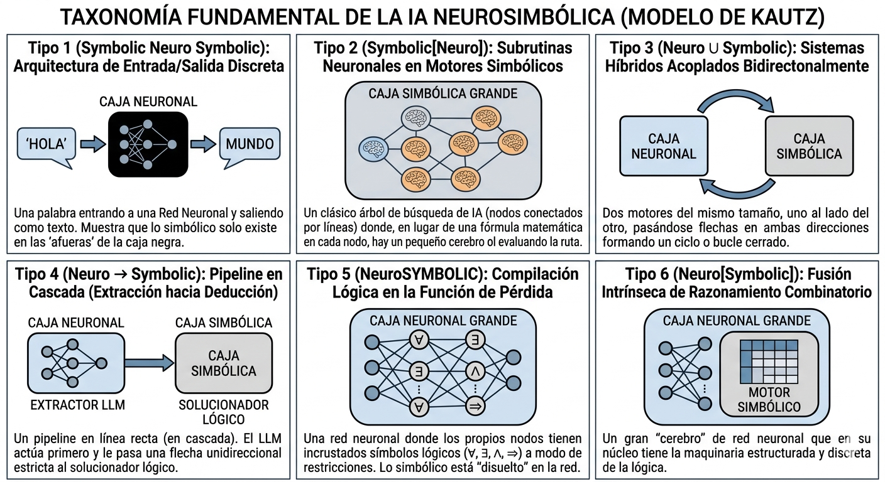

# Introducción a la IA Neurosimbólica (NeSy) y el Paradigma LLM

## El Problema del "Symbol Grounding" y la Naturaleza del Razonamiento

Históricamente, el desarrollo de la Inteligencia Artificial ha estado dominado por dos paradigmas ortogonales: el conexionista (aprendizaje inductivo basado en datos) y el simbólico (razonamiento deductivo basado en reglas) [1], [2]. Los Grandes Modelos de Lenguaje (LLMs) encapsulan el estado del arte del paradigma conexionista, operando como arquitecturas probabilísticas masivas que sobresalen en el reconocimiento de patrones y la generalización sobre datos no estructurados, pero que son incapaces de proveer garantías formales sobre la veracidad de sus salidas.

En el extremo opuesto, la IA simbólica clásica ejecuta el razonamiento mediante motores deductivos estructurados (solucionadores SAT/SMT, planificadores PDDL o sistemas expertos), los cuales garantizan un comportamiento completamente determinista, explicabilidad absoluta y seguridad matemáticamente verificable. 

Sin embargo, la computación simbólica sufre de un cuello de botella crítico en la adquisición de conocimiento: es intolerante al ruido y requiere una traducción manual exhaustiva de los entornos reales de alta dimensionalidad a representaciones formales rígidas.

A pesar de que técnicas de inyección de prompts (como Chain-of-Thought) inducen capacidades emergentes de razonamiento paso a paso en los LLMs [3], estos modelos siguen siendo fundamentalmente cajas negras estocásticas que carecen de un mecanismo intrínseco para asegurar la fidelidad lógica de sus inferencias. 

El problema del Symbol Grounding, formulado originalmente por Stevan Harnad en 1990, expone la imposibilidad de que un sistema computacional puramente formal adquiera semántica intrínseca basándose únicamente en la manipulación sintáctica de símbolos. En el contexto de los LLMs, este dilema persiste bajo una nueva forma: aunque los modelos proyectan secuencias de texto en espacios vectoriales de alta dimensionalidad capturando relaciones estadísticas asombrosamente ricas, estas representaciones latentes siguen "flotando" sin un anclaje causal (grounding) a las leyes discretas, la ontología y la física del mundo real. Un LLM puede generar la demostración matemática correcta de un teorema porque ha modelado la distribución de probabilidad de textos matemáticos similares, no porque su arquitectura "comprenda" los axiomas subyacentes.

Como resultado, cuando un LLM es forzado a ejecutar tareas de razonamiento deductivo o planificación a largo plazo de manera aislada (end-to-end), exhibe una degradación severa manifestada en alucinaciones, deriva semántica y violaciones a restricciones lógicas [4].

La Inteligencia Artificial Neurosimbólica (NeSy) emerge no como un ensemble superficial, sino como una solución estructural a esta dicotomía [5]. El objetivo de diseño es construir una arquitectura híbrida que emule la cognición de sistema dual [6]: el procesamiento intuitivo y probabilístico (Sistema 1) del LLM, acoplado al procesamiento deliberativo y lógico (Sistema 2) del motor simbólico. El paradigma NeSy postula que la Inteligencia Artificial General (AGI) no se alcanzará simplemente escalando el número de parámetros del Sistema 1 (LLMs), sino construyendo topologías que integren formalmente ambos sistemas.

Al utilizar LLMs estrictamente como extractores de información semántica y traductores de lenguaje natural a un formalismo lógico (como Lógica de Primer Orden o PDDL), y delegar el cálculo inferencial a un solucionador simbólico, las arquitecturas NeSy eliminan el cuello de botella de la adquisición de conocimiento sin sacrificar la trazabilidad matemática ni la transparencia del árbol de prueba final.

La barrera fundamental para orquestar la integración NeSy reside en la incompatibilidad estructural de sus representaciones de conocimiento. El paradigma conexionista de los LLMs utiliza representaciones continuas, distribuidas y sub-simbólicas (embeddings), donde el conocimiento es una propiedad emergente y holística de matrices de pesos opacas. Por el contrario, el paradigma simbólico exige representaciones discretas, localizadas y explícitas (grafos, árboles, reglas lógicas), donde cada nodo o símbolo tiene un significado semántico inmutable. La taxonomía de integración NeSy es, en el fondo, la clasificación de los diversos algoritmos de "traducción" diseñados para cruzar este abismo dimensional entre espacios métricos continuos y estructuras lógicas discretas.

## Taxonomía Fundamental de la IA Neurosimbólica (Modelo de Kautz)
Para estructurar algorítmicamente las arquitecturas de integración entre el aprendizaje estadístico y el razonamiento deductivo, la literatura académica adopta la taxonomía estándar formulada por Kautz [7]. 

> **Vídeo de referencia:** Recomendamos ver la conferencia magistral original donde se popularizó este modelo: [The Third AI Summer (AAAI 2020 Robert S. Engelmore Memorial Award Lecture)](https://www.youtube.com/watch?v=_cQITY0SPiw). En ella, el Dr. Kautz realiza una disertación exhaustiva sobre la evolución histórica y la formulación de estas seis arquitecturas.

Este modelo clasifica los sistemas Neurosimbólicos (NeSy) en seis topologías basadas en la direccionalidad del flujo de datos, el acoplamiento estructural y el mecanismo de inferencia. A continuación, se presenta esta taxonomía adaptada rigurosamente al ecosistema de los Grandes Modelos de Lenguaje (LLMs):

### Tipo 1 (Symbolic Neuro Symbolic): Arquitectura de Entrada/Salida Discreta

Es la configuración nativa de los LLMs actuales. El sistema recibe secuencias de símbolos discretos (texto en lenguaje natural), emplea una red neuronal para proyectar estos símbolos en un espacio de embeddings vectoriales continuos, procesa los patrones latentes y decodifica la salida nuevamente a símbolos discretos.

Se trata del nivel de integración más superficial. Aunque el modelo genera secuencias que aparentan coherencia lógica, no existe un motor de razonamiento formal interno ni validación estructurada. La "lógica" es meramente un subproducto estadístico del modelado de lenguaje, lo que condena al sistema a alucinaciones severas y falencias críticas en deducciones multi-paso complejas.

### Tipo 2 (Symbolic[Neuro]): Subrutinas Neuronales en Motores Simbólicos

La arquitectura es gobernada por un solver simbólico clásico (ej. un planificador o un motor de búsqueda en árboles como AlphaGo) que delega tareas intratables analíticamente a submódulos neuronales. En el contexto de los LLMs, el modelo de lenguaje actúa estrictamente como una función heurística. El motor simbólico genera un árbol de estados lógicos y utiliza el LLM en cada nodo para evaluar la probabilidad de éxito de una ramificación o extraer características semánticas específicas.

El acoplamiento es débil. La invocación repetitiva de un LLM masivo (miles de millones de parámetros) en cada nodo de un árbol de búsqueda simbólica introduce una latencia prohibitiva. Esta arquitectura es computacionalmente ineficiente para sistemas que requieren inferencia en tiempo real.

### Tipo 3 (Neuro ∪ Symbolic): Sistemas Híbridos Acoplados Bidireccionalmente

Consiste en un bucle cooperativo donde los componentes estadísticos y deductivos interactúan dinámicamente. Un LLM ingiere datos no estructurados y computa distribuciones de probabilidad sobre hechos o premisas. Estas predicciones probabilísticas se inyectan en un motor de inferencia lógico-probabilística (como ProbLog). El motor simbólico computa la demostración lógica y, crucialmente, calcula el gradiente de pérdida basado en el éxito de la prueba, retropropagando este error hacia la red neuronal para actualizar sus pesos.

Aunque permite un aprendizaje guiado por la lógica, la retropropagación a través de motores de inferencia discretos requiere técnicas complejas de estimación de gradientes. El costo computacional de calcular conteos de modelos algebraicos (algebraic model counting) en cada iteración vuelve a esta arquitectura sumamente difícil de escalar a la dimensionalidad de un LLM moderno.

### Tipo 4 (Neuro → Symbolic): Pipeline en Cascada (Extracción hacia Deducción)

Es el paradigma dominante en la integración NeSy en tiempo de inferencia. El LLM opera exclusivamente como un Extractor de Información (IE) o analizador semántico (Semantic Parser). El LLM recibe el prompt en lenguaje natural y lo compila en representaciones formales estrictas (p. ej. Lógica de Primer Orden, consultas SPARQL, o lenguaje PDDL). Esta salida estructurada se pasa como input determinista a un solucionador simbólico externo (ej. solvers SMT o motores de conocimiento), el cual ejecuta el razonamiento formal y devuelve la respuesta.

Este enfoque adolece de una vulnerabilidad crítica en la interfaz de traducción. Dado que la comunicación es unidireccional y el solver simbólico carece de tolerancia a la ambigüedad, si el LLM omite una premisa, alucina una variable no declarada o comete un error sintáctico mínimo en la extracción, la cadena de ejecución colapsa catastróficamente.

### Tipo 5 (NeuroSYMBOLIC): Compilación Lógica en la Función de Pérdida

Esta topología integra el conocimiento deductivo durante el entrenamiento de la red, sin depender de solvers externos en tiempo de inferencia. Se emplean marcos como Lógica Difusa (Fuzzy Logic) y Logic Tensor Networks (LTNs) [8], [9] que relajan las funciones booleanas discretas de la Lógica de Primer Orden hacia una lógica difusa continua y diferenciable. Las reglas simbólicas se inyectan como restricciones suaves (soft-constraints) en la función de pérdida. Durante el entrenamiento, la red es penalizada topológicamente si sus predicciones violan los axiomas lógicos predefinidos [10].

Una aproximación estándar es el uso de funciones de pérdida semántica (Semantic Loss). En este paradigma, el optimizador no solo evalúa el error predictivo tradicional, sino que computa el conteo de modelos ponderados (Weighted Model Counting), calculando la probabilidad marginal de que la salida de la red satisfaga un conjunto de fórmulas lógicas predefinidas. La red es penalizada topológicamente durante el gradiente descendente si sus representaciones latentes violan axiomas físicos o lógicos, forzándola a converger en un espacio paramétrico intrínsecamente coherente con las reglas del dominio.

Obligar a un LLM a optimizar restricciones lógicas complejas sobre una distribución marginal durante el backpropagation eleva exponencialmente la carga computacional. Además, este enfoque es una aproximación estadística de la lógica; la red "aprende" a imitar reglas lógicas, pero en tiempo de inferencia no ofrece ninguna garantía determinista ni verificabilidad matemática estricta contra violaciones de restricciones.

### Tipo 6 (Neuro[Symbolic]): Fusión Intrínseca de Razonamiento Combinatorio

Representa el nivel máximo de integración teórica. Un motor de pensamiento simbólico se incrusta estructuralmente en el tejido de la arquitectura neuronal. El sistema emula de forma nativa la resolución analítica mediante cálculos tensoriales, permitiendo que la red neuronal ejecute razonamiento formal, deducción y planificación combinatoria de manera simultánea al procesamiento sub-simbólico continuo. Es el equivalente algorítmico a la unificación perfecta del Sistema 1 (intuitivo/estadístico) y el Sistema 2 (deliberativo/lógico) de Kahneman.

En el estado del arte de la inteligencia artificial, el Tipo 6 sigue siendo un horizonte teórico. Ningún LLM actual logra emular el razonamiento combinatorio algorítmico de manera intrínseca y escalable, manteniendo a esta categoría como el principal reto abierto de la investigación en arquitecturas NeSy.

  

  <em>Figura: Taxonomía de Kautz aplicada a arquitecturas de IA neurosimbólica.</em>

## Grandes Modelos de Lenguaje (LLMs) y su Mapeo Taxonómico

En su arquitectura nativa, los Grandes Modelos de Lenguaje operan bajo el Tipo 1 (Symbolic Neuro Symbolic) de la taxonomía de Kautz. Estos modelos ingieren secuencias de símbolos discretos (texto en lenguaje natural), los proyectan en un espacio de embeddings vectoriales para su procesamiento sub-simbólico, y decodifican la salida nuevamente hacia el espacio discreto. En este nivel de integración superficial, la coherencia deductiva es un mero subproducto estadístico del modelado de lenguaje autorregresivo. Al carecer de un motor de inferencia formal interno, los LLMs exhiben fallas sistemáticas en la verificación de hechos y son estructuralmente propensos a contradecir sus propias premisas durante el razonamiento lógico complejo.

Para dotar a los LLMs de capacidades deductivas y garantías de seguridad, la ingeniería de IA actual mapea su arquitectura hacia niveles superiores de integración NeSy. La literatura divide estos esfuerzos en dos paradigmas ortogonales: la inyección de restricciones durante la optimización de parámetros y la orquestación modular en tiempo de inferencia.

### Integración en el Entrenamiento (Optimización de Parámetros - Mapeo a Tipo 5) 

Este enfoque, correspondiente al Tipo 5 (NeuroSYMBOLIC), prescinde de solvers externos durante el tiempo de ejecución. En su lugar, el conocimiento simbólico y las reglas deductivas se compilan directamente en los pesos de la red neuronal como restricciones suaves (soft-constraints) durante la fase de entrenamiento (ej. Logic Tensor Networks o LTNs).

Dado que el cálculo de gradientes es incompatible con la lógica booleana discreta, las restricciones formales se relajan hacia dominios continuos y diferenciables. Una implementación matemática estándar es la Semantic Loss (Pérdida Semántica) [11]. En este flujo, el LLM genera una distribución de probabilidad sobre los valores de verdad de un conjunto de hechos. Posteriormente, el optimizador calcula el conteo de modelos ponderados (Weighted Model Counting), evaluando la probabilidad marginal de que la distribución de verdad del LLM satisfaga un conjunto de fórmulas lógicas predefinidas. Al minimizar el logaritmo negativo de esta probabilidad, se fuerza a la topología de la red a converger hacia un espacio latente que evite contradicciones lógicas.

Computar la satisfacción de fórmulas lógicas sobre distribuciones marginales en cada iteración del backpropagation introduce un coste computacional prohibitivo, limitando severamente su escalabilidad a LLMs de miles de millones de parámetros. Más críticamente, este método solo aproxima el comportamiento lógico desde una perspectiva probabilística, por lo que no puede proveer garantías matemáticas deterministas contra la violación de restricciones en entornos de ejecución reales.

### Integración en Tiempo de Inferencia (Uso de Herramientas y Solvers - Mapeo a Tipo 3 y Tipo 4) 

Este es el paradigma dominante en arquitecturas del estado del arte, ejemplificado en marcos como Logic-LM [12], DUPLEX [13] y LLM+P [14]. Orquesta un acoplamiento modular en cascada (Tipo 4: Neuro → Symbolic) o bidireccional iterativo (Tipo 3: Neuro ∪ Symbolic), delegando el razonamiento estricto a motores deductivos externos y limitando al LLM a funciones de interfaz semántica.

Pipeline:

1. **Extracción de Información (IE) y Formulación**: El LLM recibe una instrucción en lenguaje natural no estructurado. Guiado por esquemas predefinidos (mediante prompting o in-context learning), el modelo actúa como un extractor de entidades y relaciones, mapeándolas de forma determinista hacia un lenguaje formal tipado, como Planning Domain Definition Language (PDDL) o sintaxis para solucionadores SMT [15].

2. **Razonamiento Simbólico**: Esta formulación simbólica se transfiere a un motor de inferencia determinista (ej. Z3, planificadores como Fast Downward o motores Prolog). El solver computa la prueba lógica o la ruta de búsqueda óptima sin intervención neuronal [16].

3. **Bucle de Reflexión (Self-Refinement)**: Si el motor simbólico detecta una sintaxis malformada o una formulación lógicamente irresoluble (ej. dependencias insatisfechas), el mensaje de error del compilador se inyecta de vuelta en la ventana de contexto del LLM. Esta retroalimentación lingüística aproxima un comportamiento Tipo 3 (Neuro ∪ Symbolic), aunque técnicamente sigue siendo un pipeline Tipo 4 iterativo o de uso de herramientas (Tool-use), orquestando un bucle de corrección. El modelo utiliza esta señal de diagnóstico para revisar, depurar y regenerar iterativamente la representación simbólica inicial sin intervención humana.

Esta arquitectura presenta una vulnerabilidad extrema en la capa inicial de traducción. Si el LLM omite una precondición implícita del entorno, alucina un predicado fuera del vocabulario o corrompe la sintaxis durante la extracción de información, la ejecución del solver colapsa catastróficamente. Además, la dependencia del bucle de Self-Refinement, combinada con la complejidad temporal intrínseca (a menudo NP-Hard o PSPACE) de los solvers SMT y planificadores clásicos, genera picos de latencia inaceptables [17]. Esto inhabilita el uso de estos pipelines NeSy para sistemas autónomos que requieran inferencia y planificación reactiva en tiempo real.

Estas vulnerabilidades en la interfaz de traducción demuestran que, si bien la integración NeSy ofrece un camino prometedor, es imperativo analizar en profundidad las fallas estructurales inherentes a los modelos conexionistas puros para comprender por qué el "rescate simbólico" es indispensable en tareas críticas, como se detallará en la siguiente sección.

> **Vídeo ilustrativo:** Para una representación visual didáctica sobre la fusión del reconocimiento de patrones (paradigma conexionista) con la extrapolación lógica (paradigma simbólico), consulta el video introductorio de IBM Technology: [What Is NeuroSymbolic AI? Bridging Reasoning & Neural Networks](https://www.youtube.com/watch?v=ZfWDVO3rzeA).

---

### Referencias

[1] W. Wang, Y. Yang, and F. Wu, "Towards Data-And Knowledge-Driven AI: A Survey on Neuro-Symbolic Computing," *IEEE Transactions on Pattern Analysis and Machine Intelligence*, vol. 47, no. 2, pp. 878-899, 2025.

[2] B. P. Bhuyan, A. Ramdane-Cherif, R. Tomar, and T. P. Singh, "Neuro-symbolic artificial intelligence: a survey," *Artificial Intelligence Review*, 2024.

[3] A. Patil and A. Jadon, "Advancing Reasoning in Large Language Models: Promising Methods and Approaches," 2025.

[4] M. Fang, S. Deng, Y. Zhang, Z. Shi, L. Chen, M. Pechenizkiy, and J. Wang, "Large Language Models Are Neurosymbolic Reasoners," 2024

[5] M. K. Sarker, L. Zhou, A. Eberhart, and P. Hitzler, "Neuro-Symbolic Artificial Intelligence: Current Trends," 2021.

[6] D. Kahneman, *Thinking, Fast and Slow*. Farrar, Straus and Giroux, 2011.

[7] H. Kautz, "The Third AI Summer: AAAI Robert S. Engelmore Memorial Lecture," *AI Magazine*, 2022.

[8] L. Serafini and A. d'Avila Garcez, "Logic Tensor Networks: Deep Learning and Logical Reasoning from Data and Knowledge," 2016

[9] R. Riegel et al., "Logical Neural Networks," 2020.

[10] D. Calanzone, S. Teso, and A. Vergari, "Logically Consistent Language Models via Neuro-Symbolic Integration," 2024.

[11] J. Xu, Z. Zhang, T. Friedman, Y. Liang, and G. Broeck, "A Semantic Loss Function for Deep Learning with Symbolic Knowledge," 2018.

[12] L. Pan, A. Albalak, X. Wang, and W. Y. Wang, "LOGIC-LM: Empowering Large Language Models with Symbolic Solvers for Faithful Logical Reasoning," 2023.

[13] K. Hua, Y. Gu, D. Wang, and X. Ma, "DUPLEX: Agentic Dual-System Planning via LLM-Driven Information Extraction," 2026.

[14] B. Liu et al., "LLM+P: Empowering Large Language Models with Optimal Planning Proficiency," 2023.

[15] S. K. Jha, R. Ewetz, and S. Neema, "Counterexample Guided Inductive Synthesis Using Large Language Models and Satisfiability Solving," 2023.

[16] N. Weir, P. Clark, and B. Van Durme, "NELLIE: A Neuro-Symbolic Inference Engine for Grounded, Compositional, and Explainable Reasoning," 2024.

[17] M. Besta et al., "Graph of Thoughts: Solving Elaborate Problems with Large Language Models," 2024.
