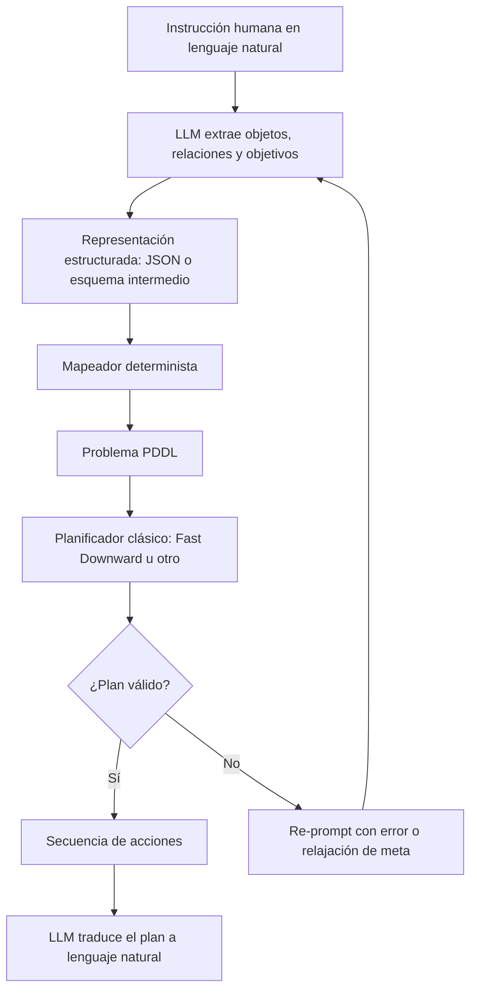
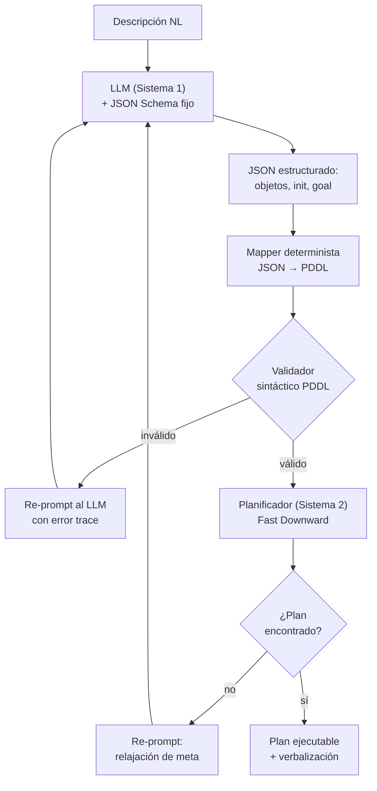
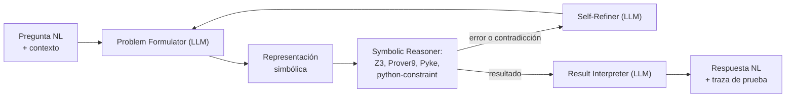
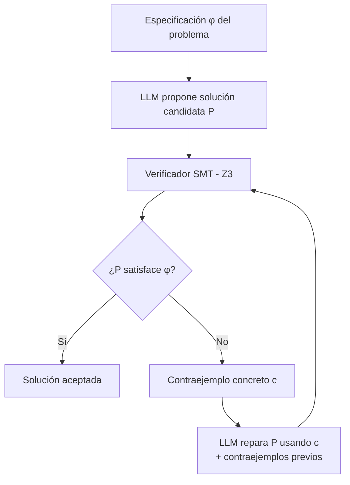
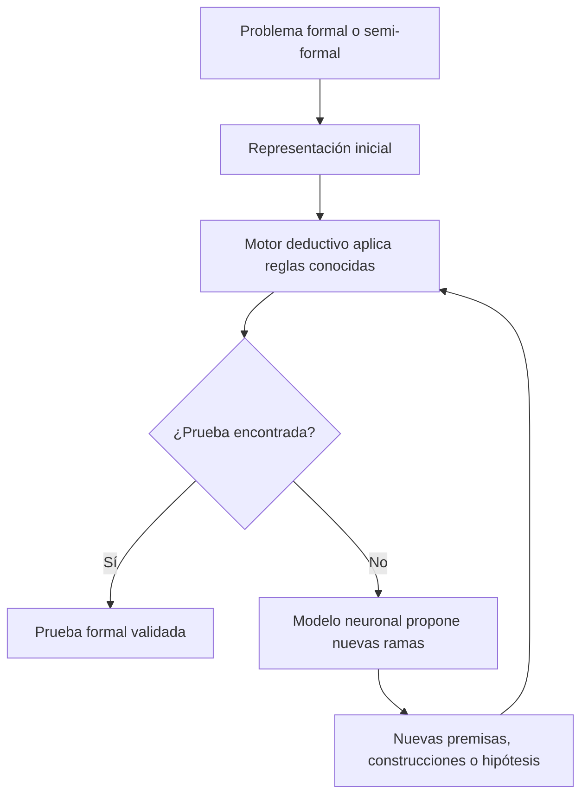
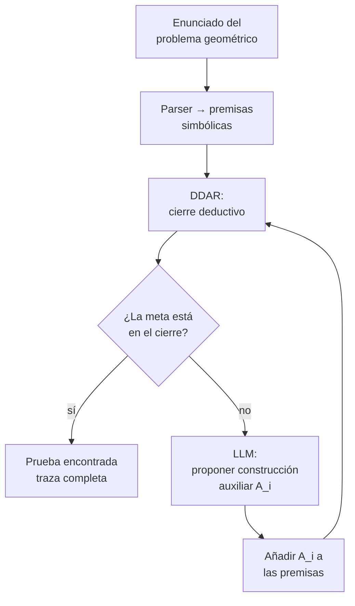
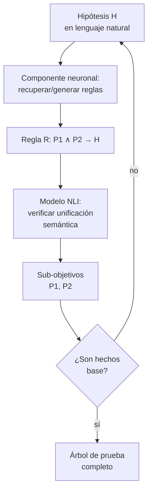
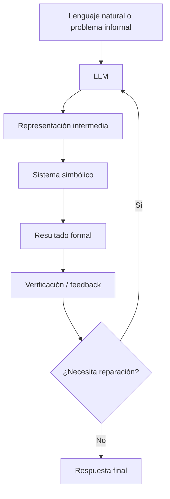

# 3. Casos de Uso y Pipelines Algorítmicos de Modelos NeSy-LLM

## 3.0. Idea central de la sección

Los modelos **Neuro-Symbolic LLM** combinan dos capacidades que, por separado,
tienen límites bien documentados:

- Los **LLMs** son fuertes interpretando lenguaje natural, generando hipótesis,
  completando patrones y adaptándose a instrucciones ambiguas, pero son
  probabilísticos y propensos a alucinaciones e inconsistencia lógica.
- Los **sistemas simbólicos** son fuertes ejecutando razonamiento formal
  verificable y determinista mediante reglas, solvers, planificadores o motores
  deductivos, pero requieren entradas formalizadas con precisión.

La hipótesis técnica detrás de los sistemas NeSy-LLM es que el LLM **no debe
ser** el componente que razona de extremo a extremo. En los pipelines modernos,
el LLM funciona como una **interfaz semántica** entre el lenguaje humano y una
representación formal; un componente simbólico ejecuta después el razonamiento
con garantías más fuertes de corrección.

Esta sección estudia tres familias de casos de uso, seleccionadas no por su
relevancia histórica sino por el **rol funcional** que asignan al LLM:

| Subsección | Rol del LLM | Componente simbólico | Mecanismo de control |
|---|---|---|---|
| 3.1 | Extractor de información (IE) guiado por esquema | Planificador clásico (Fast Downward) | Validación sintáctica del PDDL |
| 3.2 | Formulador / traductor a lógica formal | Solver SAT/SMT (Z3, Prover9) | Bucle de auto-refinamiento por error o contraejemplo |
| 3.3 | Heurística generativa (proposición de ramificaciones) | Motor deductivo (DDAR, Prolog-like) | Cierre deductivo o backward chaining |

La estructura común de estos sistemas es:


El punto crítico es que el éxito del sistema depende de la **calidad de la
traducción neurosimbólica**: si el LLM traduce mal la tarea, inventa
predicados, omite restricciones o produce una representación inválida, el
solver puede fallar aunque el razonamiento simbólico sea correcto. Confundir el
rol asignado al LLM (p. ej., usarlo como *planificador* en lugar de como
*formalizador*) es precisamente la falla que estas arquitecturas buscan
corregir [12], [16].

---

## 3.1. Planificación Robótica y Extracción de Información: LLM+P y DUPLEX

### 3.1.1. Problema que resuelven

En tareas de planificación, el usuario puede pedir algo en lenguaje natural,
por ejemplo:

> "Lleva el bloque rojo a la mesa, después mueve el bloque azul al estante y
> asegúrate de que el robot no choque con ningún obstáculo."

Un LLM puede generar una respuesta plausible, pero **no garantiza** que el plan
sea físicamente ejecutable, óptimo o consistente con las restricciones del
entorno. Trabajos sobre planificación con LLMs, incluyendo LLM+P [7], muestran
que los LLMs por sí solos no resuelven de forma fiable problemas de
planificación de horizonte largo: aproximan la distribución de planes
plausibles textualmente, sin garantías de satisfacibilidad ni optimalidad sobre
el espacio de estados.

Los planificadores clásicos pueden generar planes formalmente válidos y, bajo
configuraciones óptimas y suficiente tiempo de búsqueda (p. ej., Fast Downward
con A\* + LM-cut), planes óptimos. La contrapartida es que requieren que el
problema esté formalizado en **PDDL** (*Planning Domain Definition Language*),
un lenguaje que exige precisión sintáctica que el usuario final raramente
posee.
PDDL permite representar:

- Objetos del mundo.
- Estado inicial.
- Estado objetivo.
- Acciones disponibles, con sus precondiciones y efectos.

Tanto LLM+P [7] como DUPLEX [3] resuelven exactamente esta asimetría: emplean
al LLM como **interfaz de formalización** y delegan la búsqueda al
planificador.

### 3.1.2. Pipeline general



### 3.1.3. LLM+P [7]: traducción directa NL → PDDL

LLM+P propone un pipeline de cuatro etapas, en el que el LLM se invoca dos
veces (formalizar y verbalizar) y el solver una sola vez:

1. **Ingesta.** Se asume un dominio PDDL pre-especificado (predicados,
   acciones, precondiciones y efectos). El usuario aporta únicamente el
   *problem file* en lenguaje natural.
2. **Formalización por *in-context learning*.** Se construye un prompt que
   contiene: (a) el dominio PDDL, (b) **un único ejemplo** de par
   (descripción-NL, problem-PDDL) y (c) la nueva descripción a formalizar. El
   LLM completa los bloques `(:objects ...)`, `(:init ...)` y `(:goal ...)`.
3. **Planificación.** Se invoca un planificador clásico —Fast Downward es la
   elección estándar— sobre el par (dominio, problema). Devuelve un plan
   válido —posiblemente óptimo según la configuración— o reporta fallo por
   PDDL inválido, problema irresoluble, *timeout* o fallo de validación.
4. **Verbalización.** El LLM traduce la secuencia de acciones simbólicas a una
   explicación en lenguaje natural.

**Observación crítica.** [7] reporta mejoras importantes sobre un baseline de
planificación end-to-end con el mismo LLM, pero estos resultados se obtienen
**asumiendo que el dominio PDDL ya existe**. El problema duro de generar también
el dominio (no solo el problema concreto) queda fuera del alcance, lo que hace
a LLM+P brillante en entornos cerrados y frágil en escenarios abiertos.

### 3.1.4. DUPLEX [3]: doble sistema con IE guiada por esquema

DUPLEX es una propuesta reciente (preprint, 2026) que generaliza la línea de
LLM+P en dos direcciones que merecen análisis detallado:

**(a) Marco *dual-process*.** DUPLEX se inspira explícitamente en la dicotomía
Sistema 1 / Sistema 2 (Kahneman). El Sistema 1 es el LLM (rápido, asociativo,
propenso a alucinar); el Sistema 2 es el planificador clásico (lento,
deliberativo, *sound*). La novedad es que el Sistema 1 **no genera código ni
texto PDDL libre**: produce únicamente una representación estructurada (JSON)
restringida por un esquema fijo.

**(b) *Schema-Guided Information Extraction*.** Es la contribución central. El
LLM recibe un *prompt* que incluye un JSON Schema con campos tipados (objetos,
sus tipos, predicados unarios y binarios verdaderos en el estado inicial,
condiciones de meta). El LLM **rellena** la estructura; no la inventa. La
traducción JSON → PDDL la realiza después un *mapper* **determinista** (no un
LLM), eliminando una clase entera de alucinaciones sintácticas. Si la
implementación lo combina además con decodificación restringida por gramática
o JSON Schema (p. ej., Outlines o GBNF), la salida puede hacerse aún más
robusta; sin embargo, el aporte central de DUPLEX es la extracción guiada por
esquema y el mapeo determinista a PDDL, no un mecanismo concreto de
*constrained decoding*.



### 3.1.5. Ejemplo trabajado

Tarea:

> "El robot debe mover la caja A desde la habitación 1 hasta la habitación 2."

El LLM, restringido al schema, produce:

```json
{
  "objects": ["robot", "box_A", "room_1", "room_2"],
  "initial_state": [
    "robot_at(room_1)",
    "box_at(box_A, room_1)"
  ],
  "goal_state": [
    "box_at(box_A, room_2)"
  ]
}
```

El mapper determinista convierte esto a PDDL. El planificador devuelve:

```text
1. pick_up(robot, box_A, room_1)
2. move(robot, room_1, room_2)
3. drop(robot, box_A, room_2)
```

El LLM verbaliza:

> "El robot recoge la caja A en la habitación 1, se desplaza a la habitación 2
> y la deposita allí."

El valor del sistema **no** está en que el LLM imagine la respuesta, sino en
que el plan final fue generado por un componente simbólico que verifica
precondiciones y efectos.

### 3.1.6. Comparación LLM+P vs DUPLEX

| Sistema | Rol del LLM | Riesgo principal | Mitigación arquitectónica |
|---|---|---|---|
| **LLM+P** | Traduce NL → PDDL en una sola pasada. | Errores de sintaxis PDDL; predicados inventados. | Few-shot con un único ejemplo del dominio. |
| **DUPLEX** | Rellena un JSON Schema; el mapper traduce a PDDL. | Omisiones semánticas; objetos faltantes. | *Constrained decoding* + mapper determinista. |

LLM+P confía en que el LLM produzca PDDL sintácticamente válido en una pasada;
DUPLEX **descompone** la tarea: estructura semántica al LLM, sintaxis al
mapper. Empíricamente esto reduce la tasa de errores de parseo PDDL en
escenarios complejos, a costa de ingeniería de schema por dominio (un coste no
trivial que limita la generalización).

### 3.1.7. Evaluación crítica

Estos sistemas usan al LLM donde es fuerte (comprensión semántica flexible) y
al planificador donde es fuerte (búsqueda formal y validación de acciones). Sin
embargo, el cuello de botella es la interfaz entre ambos. Si el LLM extrae mal
los objetos, omite restricciones o genera una estructura incompleta, el
planificador resolverá un problema distinto al que el usuario realmente quería,
produciendo un plan formalmente válido pero **semánticamente equivocado**.

La lección principal: la integración NeSy no elimina los errores de los LLMs;
**los desplaza hacia la fase de traducción**.

---

## 3.2. Solucionadores SAT/SMT y Lógica de Primer Orden: Logic-LM y CEGIS

### 3.2.1. Problema que resuelven

A diferencia de la planificación, donde el output es una *secuencia* de
acciones, el razonamiento lógico requiere verificar la *consistencia* de un
conjunto de proposiciones. Los LLMs fallan en tareas de razonamiento lógico
formal, especialmente cuando se requiere consistencia estricta, manejo de
cuantificadores, inferencia multi-paso o verificación de restricciones.

La solución NeSy es traducir el problema a una representación formal y delegar
la inferencia a un **solver lógico** especializado:

- Lógica de primer orden (resuelta por Prover9).
- Programas Python restringidos.
- Fórmulas SAT (MiniSat).
- Fórmulas SMT (Z3).
- Programación lógica (Pyke).

### 3.2.2. Logic-LM [8]: pipeline triádico con auto-refinamiento

Logic-LM introduce una arquitectura modular de tres componentes, con un cuarto
componente —el **Self-Refiner**— que cierra el bucle reactivo:



**Pasos algorítmicos:**

1. **Selección de formalismo.** Logic-LM soporta cuatro formalismos: First-Order
   Logic (Prover9), Constraint Satisfaction (python-constraint), SAT (Z3 en
   modo proposicional) y Logic Programming (Pyke). La elección depende de la
   tipología de la tarea.
2. **Formalización in-context.** El LLM recibe ejemplos *few-shot* y produce la
   representación simbólica.
3. **Ejecución determinista.** El solver se ejecuta. Si la formalización es
   sintácticamente inválida, el parser devuelve un error; si es semánticamente
   inconsistente o produce una salida incompatible, el solver devuelve un
   resultado o mensaje de error que sirve como señal de feedback.
4. **Self-Refinement.** El error o la salida del solver se reenvían al LLM con
   un prompt del tipo: *"La formulación previa produjo el error X. Identifica
   la premisa errónea y reescribe la formulación."* El bucle se ejecuta
   durante un número limitado de rondas o hasta que la formulación sea
   ejecutable.
5. **Interpretación.** Si hay éxito, el LLM verbaliza la conclusión y, si el
   solver lo soporta, la traza de prueba.

### 3.2.3. Ejemplo trabajado

Problema en lenguaje natural:

> "Todos los médicos son profesionales. Ana es médica. ¿Ana es profesional?"

El LLM produce una formulación FOL:

```text
∀x. Doctor(x) → Professional(x)
Doctor(Ana)
query: Professional(Ana)
```

Prover9 verifica que la conclusión se sigue de las premisas. Resultado formal:
`Professional(Ana)` es verdadero.

El LLM verbaliza:

> "Sí. Como todos los médicos son profesionales y Ana es médica, entonces Ana
> es profesional."

El razonamiento final no depende de la intuición probabilística del LLM, sino
de una validación lógica externa.

### 3.2.4. Self-Refinement: bucle de reparación

Cuando el solver detecta un error, este se devuelve al LLM. Ejemplo:

```text
Z3 error: unknown predicate Profesional(x)
```

Re-prompt:

```text
La fórmula anterior falló porque usaste el predicado Profesional(x),
pero el esquema permitido solo contiene Professional(x).
Reescribe la fórmula usando únicamente los predicados válidos.
```

El sistema corrige errores sin intervención humana. La desventaja: aumenta la
latencia y **no garantiza convergencia**; el LLM puede reparar un error e
introducir otro. Logic-LM reporta mejoras importantes sobre *chain-of-thought*
puro en benchmarks de razonamiento lógico (ProofWriter, FOLIO), y el bucle de
Self-Refinement es responsable de una fracción significativa de esa ganancia
—lo que cuantifica la magnitud del problema de fragilidad de traducción que
discutirá la Sección 4.

### 3.2.5. CEGIS [2]: síntesis inductiva guiada por contraejemplo

**CEGIS** (*Counterexample-Guided Inductive Synthesis*) es un esquema clásico
de síntesis de programas formalizado por Solar-Lezama. Jha et al. [2]
demuestran cómo acoplarlo a un LLM para obtener un sintetizador de programas
verificables.



**Bucle algorítmico:**

```text
Entrada: especificación φ (en SMT-LIB o como pre/postcondiciones)
Estado:  conjunto C de contraejemplos, inicialmente vacío

repetir:
    1. Síntesis (LLM):
       prompt = φ + "Programas previos rechazados por estos contraejemplos: " + C
       P ← LLM(prompt)
    2. Verificación (Z3):
       consulta ← ¬(∀x. P(x) satisface φ)
       si Z3(consulta) = UNSAT:
           retornar P  # programa verificado
       si Z3(consulta) = SAT:
           c ← modelo de Z3  # contraejemplo concreto
           C ← C ∪ {c}
hasta convergencia o timeout
```

**Punto técnico clave.** Lo crucial de CEGIS es que el LLM **no necesita
producir un programa correcto en un solo intento**: produce candidatos, y el
solver actúa como oráculo de rechazo *con prueba constructiva*. Cada
contraejemplo `c` es un **input concreto** sobre el cual el programa propuesto
falla, lo que constituye una señal de retroalimentación mucho más rica que un
error genérico. En la práctica, el espacio de búsqueda colapsa rápidamente.

### 3.2.6. Logic-LM vs CEGIS: la densidad de la señal de feedback

La diferencia más importante entre ambos sistemas no es el solver, sino **la
naturaleza del feedback** en el bucle de refinamiento:

| Aspecto | Logic-LM | CEGIS |
|---|---|---|
| Tipo de error que reinyecta | Mensajes de error del parser o salidas del solver. | **Modelo concreto** (asignación de variables) que falsifica el candidato. |
| Densidad de la señal | Baja: el LLM debe inferir qué premisa cambiar. | Alta: el contraejemplo ancla la próxima iteración. |
| Convergencia típica | Variable; puede oscilar. | Convergencia rápida en pocas iteraciones. |
| Requisito sobre el problema | El problema debe ser formalizable en uno de los formalismos soportados. | La especificación φ debe ser formalizable manualmente. |

Esta distinción explica por qué CEGIS converge más rápido en dominios donde φ
es expresable: cada iteración elimina una región concreta del espacio de
candidatos, mientras que Logic-LM debe inferir indirectamente qué premisa
modificar.

### 3.2.7. Evaluación crítica

La integración con SAT/SMT y lógica formal mejora claramente el razonamiento
puramente generativo: detecta inconsistencias, valida inferencias y produce
respuestas más fieles a una especificación. Sin embargo, persisten tres
problemas estructurales:

1. **Error de formalización.** Si el LLM traduce mal el problema, el solver
   resolverá una versión equivocada.
2. **Dependencia del esquema.** El sistema necesita predicados, tipos y
   restricciones bien definidos a priori.
3. **Coste de iteración.** Cada ciclo de reparación requiere nuevas llamadas al
   LLM y al solver.

Logic-LM y CEGIS no convierten al LLM en un razonador formal puro: lo
convierten en un **generador y reparador de representaciones** verificadas por
herramientas externas.

---

## 3.3. Sistemas Expertos Neuronales y Búsqueda de Pruebas: AlphaGeometry2 y NELLIE

### 3.3.1. Problema que resuelven

En dominios como geometría olímpica o razonamiento composicional sobre lenguaje
científico, no basta con producir una respuesta final: el sistema debe generar
una **prueba** —una cadena de inferencias formalmente auditable.

Las dos arquitecturas anteriores delegan **toda** la búsqueda al solver. Esta
tercera categoría hace lo opuesto: el solver opera, pero el LLM **guía la
búsqueda** actuando como heurística generativa. El paralelo conceptual es
AlphaZero (red de políticas + MCTS), trasladado al dominio simbólico.



### 3.3.2. AlphaGeometry2 [4], [15]: heurística neuronal sobre cierre deductivo

AlphaGeometry y su sucesor AlphaGeometry2 alcanzaron rendimiento de medalla de
oro en geometría olímpica. Su arquitectura es paradigmática del patrón "LM como
heurística".

**Componentes:**

- **DDAR (*Deductive Database Arithmetic Reasoning*).** Motor simbólico que,
  dado un conjunto de premisas geométricas (puntos, líneas, círculos,
  congruencias), cierra deductivamente todas las consecuencias derivables vía
  un conjunto fijo de reglas (*forward chaining*). Es completo dentro de su
  fragmento, pero **insuficiente** para problemas no triviales: muchas pruebas
  olímpicas requieren **construcciones auxiliares** —puntos, líneas o círculos
  no presentes en el enunciado.
- **LLM heurístico.** En el sistema original [15], un transformer entrenado
  desde cero sobre una base masiva de teoremas sintéticos generados por el
  propio DDAR. Su función: proponer construcciones auxiliares plausibles.
  AlphaGeometry2 [4] sustituye el transformer por un Gemini *fine-tuneado*.

**Pipeline algorítmico:**



**Pasos:**

1. **Parseo.** El enunciado se traduce a proposiciones en el lenguaje formal de
   DDAR (determinista, sin LLM).
2. **Cierre deductivo inicial.** DDAR aplica todas las reglas hasta saturación.
   Si la meta aparece en el cierre, la prueba termina.
3. **Proposición heurística.** Si no, el LLM examina el estado actual y propone
   una construcción auxiliar (p. ej., "sea M el punto medio de AB").
4. **Iteración.** La construcción se añade a las premisas y DDAR se re-ejecuta.
   El bucle continúa hasta encontrar la prueba o agotar un presupuesto de
   construcciones.

**El patrón arquitectónico clave.** El LLM **nunca afirma** que la prueba es
válida; esa responsabilidad recae 100 % en DDAR. El LLM es estrictamente un
**proponente de ramificaciones** en un árbol de búsqueda cuyas hojas son
verificadas por el motor simbólico. Esta separación —**generación neuronal,
verificación simbólica**— es el patrón que mejor encarna los ideales del
paradigma NeSy.

AlphaGeometry2 mejora sobre [15] con: (i) un lenguaje de dominio extendido que
cubre objetos en movimiento, ecuaciones lineales de ángulos, razones y
distancias, teoremas de tipo *locus* y problemas no constructivos; (ii) un
solver simbólico reescrito en C++ con mejoras significativas de velocidad; y
(iii) un modelo Gemini *fine-tuneado* en lugar del transformer entrenado desde
cero, lo que aumenta sustancialmente el ratio de problemas IMO resueltos
respecto al sistema original.

### 3.3.3. NELLIE [11]: backward chaining neuro-simbólico

NELLIE aborda razonamiento composicional sobre lenguaje natural científico
(p. ej., *"¿Por qué hierve el agua a 100 °C al nivel del mar?"*). Su estrategia
es opuesta a AlphaGeometry2: en lugar de cierre deductivo *forward*, NELLIE usa
**backward chaining** estilo Prolog.

**Idea clave.** Dada una hipótesis H a probar, NELLIE busca recursivamente
reglas R tales que el consecuente de R unifique con H, y entonces intenta
probar los antecedentes de R. La búsqueda imita SLD-resolution. **La novedad:
los átomos no son símbolos sintácticos, son frases en lenguaje natural**, y el
componente neuronal de NELLIE —que combina modelado de lenguaje, generación
guiada y recuperación densa— realiza tres funciones:

1. **Recuperación de reglas.** Dado un objetivo H, el componente neuronal (vía
   *dense retrieval* o generación) propone reglas relevantes de un corpus de
   conocimiento.
2. **Unificación semántica.** En lugar de unificación sintáctica (Prolog),
   NELLIE evalúa si dos frases son *entailment-equivalentes* mediante un
   modelo NLI (*Natural Language Inference*).
3. **Generación de reglas.** Si ninguna regla del corpus aplica, el componente
   neuronal *genera* una regla candidata, que se verifica por consistencia con
   el resto de la base.



**Resultado.** NELLIE construye **árboles de prueba explícitos** —no cadenas
opacas de *chain-of-thought*— sobre EntailmentBank y otros benchmarks de QA
científico. El árbol es auditable, propiedad que la Sección 5.2 requerirá para
dominios de alto riesgo (medicina, derecho).

### 3.3.4. Evaluación crítica

AlphaGeometry2 y NELLIE representan una integración más profunda que los
pipelines de traducción simple: el componente neuronal participa activamente en
la exploración del espacio de soluciones.

El riesgo principal es el **coste de búsqueda**. En dominios complejos, el
número de posibles ramas, submetas o construcciones auxiliares crece de manera
explosiva. El sistema necesita heurísticas fuertes para no perderse. La ventaja
es que, cuando funciona, el resultado final es mucho más confiable que una
respuesta de un LLM puro, porque queda respaldado por una cadena de inferencia
simbólica.

Hay además un trade-off entre **soundness y generalidad**: AlphaGeometry2 es
extremadamente sound pero opera solo en geometría euclidiana; NELLIE es más
general pero su unificación semántica vía NLI introduce ruido que el motor de
Prolog clásico no tendría.

---

## 3.4. Síntesis comparativa

Las seis arquitecturas analizadas pueden organizarse en una matriz que cruza
**rol del LLM** (formalizador vs. heurística) con el **régimen de control
simbólico** (búsqueda determinista sobre representación formalizada vs.
búsqueda guiada por heurística aprendida). La matriz es una clasificación
**interpretativa**, no una taxonomía formal: no todos los sistemas implementan
literalmente *forward* o *backward chaining*.

| | **Búsqueda determinista sobre representación formalizada** | **Búsqueda guiada por heurística aprendida** |
|---|---|---|
| **LLM como formalizador** | LLM+P, DUPLEX (NL → PDDL → planificador A\*) <br> Logic-LM, CEGIS (NL → FOL/SMT → solver) | — |
| **LLM como heurística** | — | AlphaGeometry2 (DDAR + construcciones auxiliares) <br> NELLIE (Prolog-style + retrieval semántico) |

La matriz pone de manifiesto un patrón: cuando el LLM solo formaliza, el
componente simbólico realiza una **búsqueda determinista clásica** (heurísticas
admisibles en planificación, DPLL/CDCL en SAT/SMT) sobre una representación
fija. Cuando el LLM actúa como heurística generativa, la búsqueda se vuelve
**iterativa y dirigida por proposiciones del modelo neuronal**, evaluadas por
el motor simbólico. Las dos celdas vacías de la matriz —*formalizador con
búsqueda heurística aprendida* y *heurística con búsqueda determinista
clásica*— corresponden a combinaciones poco exploradas en la literatura
revisada.

Vista lado a lado, la comparativa funcional de las tres familias queda:

| Familia | Ejemplos | Rol del LLM | Rol simbólico | Fortaleza | Fragilidad principal |
|---|---|---|---|---|---|
| Planificación | LLM+P, DUPLEX | Extraer e (idealmente) estructurar bajo schema. | Generar planes verificables. | Planes ejecutables y validados. | Mala traducción de objetos, acciones o metas. |
| Lógica formal | Logic-LM, CEGIS | Formular y reparar usando feedback del solver. | Validar fórmulas, dar contraejemplos. | Corrección lógica fuerte. | Error de formalización inicial; oscilación en refinamiento. |
| Búsqueda de pruebas | AlphaGeometry2, NELLIE | Proponer ramas, hipótesis o construcciones. | Deducir, verificar y cerrar pruebas. | Explicabilidad y trazabilidad. | Explosión combinatoria del espacio. |

---

## 3.5. Patrón arquitectónico común

Aunque los casos de uso difieren, todos siguen el mismo invariante:



El invariante puede formularse así:

> **El LLM interpreta, traduce o propone; el sistema simbólico verifica,
> planifica o deduce.**

La promesa de la IA neurosimbólica en LLMs no consiste en hacer que el modelo
neuronal sea perfecto; consiste en diseñar una arquitectura donde sus errores
puedan ser **detectados, corregidos o limitados** por componentes formales
externos.

---

## 3.6. Conclusión y transición a la Sección 4

Los casos revisados muestran que la integración NeSy-LLM es más útil cuando
existe una separación clara de responsabilidades: el LLM aporta flexibilidad
semántica, adaptación al lenguaje natural y capacidad heurística; el componente
simbólico aporta verificación, estructura, trazabilidad y consistencia lógica.

Tres observaciones cierran la sección y abren la crítica que se desarrollará en
la Sección 4:

1. **Todos los sistemas pagan un coste de invocación al solver no trivial.** En
   AlphaGeometry2, cada construcción auxiliar dispara un cierre deductivo
   completo; en CEGIS, cada candidato se verifica con Z3; en LLM+P, el
   planificador se ejecuta una vez pero con coste exponencial en el peor caso.
   La latencia acumulada limita la aplicación en tiempo real (Sección 4.1).
2. **La interfaz NL → formal es el eslabón débil universal.** En LLM+P, una
   alucinación en `(:init ...)` invalida el plan; en Logic-LM, una
   cuantificación errónea cambia el resultado deductivo; en AlphaGeometry2 una
   construcción mal nombrada rompe la unificación con DDAR. Esta fragilidad de
   traducción se examina en 4.2.
3. **La soundness se compra con generalidad.** Cuanto más estricto es el
   componente simbólico (Z3 > Fast Downward > DDAR > NLI semántico de NELLIE),
   más estrecho es el dominio cubierto. NELLIE es el más general y el menos
   *sound*; AlphaGeometry2 es el más sound y el menos transferible.

El punto más vulnerable sigue siendo el **symbol grounding**: la conexión entre
las palabras del usuario y los símbolos que manipula el sistema formal. Si esa
conexión falla, todo el pipeline puede producir una salida formalmente correcta
pero semánticamente equivocada. El futuro de estos sistemas dependerá menos de
"añadir un solver" a un LLM y más de **diseñar interfaces robustas** entre
lenguaje natural, representaciones estructuradas y razonamiento formal —tema
que la Sección 4 aborda desde el ángulo de los cuellos de botella técnicos y
la fragilidad arquitectónica.

---

## Referencias citadas en esta sección

(Numeración consistente con la bibliografía general de la propuesta.)

[2] S. K. Jha *et al.*, "Counterexample Guided Inductive Synthesis Using Large Language Models and Satisfiability Solving," *MILCOM 2023*.
[3] K. Hua, D. Wang, Y. Gu, X. Ma, "DUPLEX: Agentic Dual-System Planning via LLM-Driven Information Extraction," arXiv:2603.23909.
[4] Y. Chervonyi *et al.*, "Gold-medalist Performance in Solving Olympiad Geometry with AlphaGeometry2," arXiv:2502.03544.
[7] B. Liu *et al.*, "LLM+P: Empowering Large Language Models with Optimal Planning Proficiency," arXiv:2304.11477.
[8] L. Pan, A. Albalak, X. Wang, W. Wang, "Logic-LM: Empowering Large Language Models with Symbolic Solvers for Faithful Logical Reasoning," EMNLP Findings 2023.
[11] N. Weir, P. Clark, B. Van Durme, "NELLIE: A Neuro-Symbolic Inference Engine for Grounded, Compositional, and Explainable Reasoning," arXiv:2209.07662.
[12] B. P. Bhuyan *et al.*, "Neuro-symbolic artificial intelligence: a survey," *Neural Comput & Applic*, 2024.
[15] T. H. Trinh *et al.*, "Solving olympiad geometry without human demonstrations," *Nature*, 2024.
[16] W. Wang, Y. Yang, F. Wu, "Towards Data- and Knowledge-Driven AI: A Survey on Neuro-Symbolic Computing," *IEEE TPAMI*, 2025.