# Fragilidad de traducción

!!! tip "TL;DR"
    Si el LLM traduce mal el problema, el solver puede fallar o, peor, resolver
    correctamente un problema equivocado. Este es el modo de falla universal de
    los pipelines `Neuro → Symbolic`.

## Cuatro errores típicos

| Error | Ejemplo | Consecuencia |
|---|---|---|
| Sintaxis inválida | Paréntesis PDDL roto | Parser falla |
| Predicado inventado | `Profesional(x)` vs `Professional(x)` | Solver no reconoce |
| Omisión | Falta una precondición | Plan inválido |
| Semántica desviada | Meta mal formalizada | Plan correcto para problema equivocado |

## Mitigaciones

- [Self-refinement](../tecnicas/self-refinement.md)
- [Schema-guided IE](../tecnicas/schema-guided-ie.md)
- [CEGIS](../sistemas/cegis.md)

!!! warning "Lo difícil"
    La sintaxis se puede validar. La intención semántica del usuario es mucho
    más difícil de comprobar.

## Ver también

- [DUPLEX](../sistemas/duplex.md)
- [Explainability laundering](../etica/explainability-laundering.md)
- [Matriz funcional](../comparativas/matriz-funcional.md)
