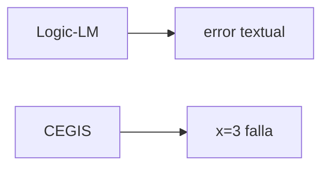

# Logic-LM vs CEGIS: la densidad del feedback

!!! tip "TL;DR"
    Ambos combinan LLM + solver con reparación. Logic-LM recibe errores o
    diagnósticos; CEGIS recibe contraejemplos concretos. Esa diferencia hace que
    CEGIS tenga una señal de feedback más densa.

## Tabla comparativa

| Aspecto | Logic-LM | CEGIS |
|---|---|---|
| Tarea | Razonamiento lógico | Síntesis verificable |
| Solver | Prover9, Z3, Pyke | Z3 |
| Feedback | Mensaje de error / salida | Contraejemplo concreto |
| Densidad | Baja-media | Alta |
| Riesgo | Oscilación | Especificación mal formada |

## Imagen mental

Un contraejemplo reduce el espacio de búsqueda de forma más concreta que un
mensaje genérico.

## Ver también

- [Logic-LM](../sistemas/logic-lm.md)
- [CEGIS](../sistemas/cegis.md)
- [Self-refinement](../tecnicas/self-refinement.md)
