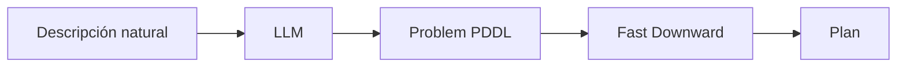
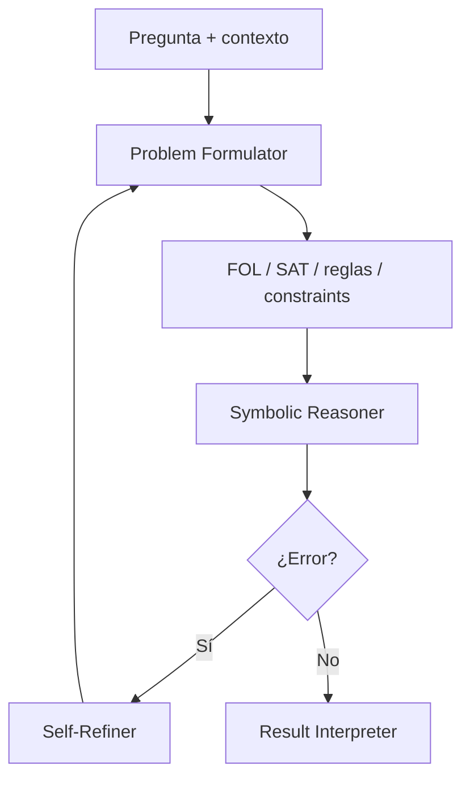
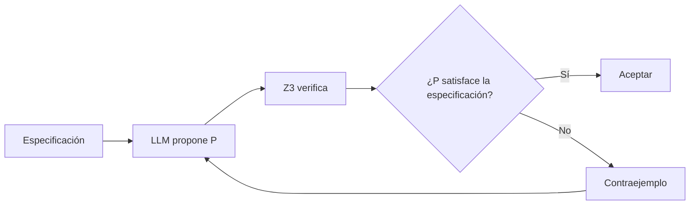
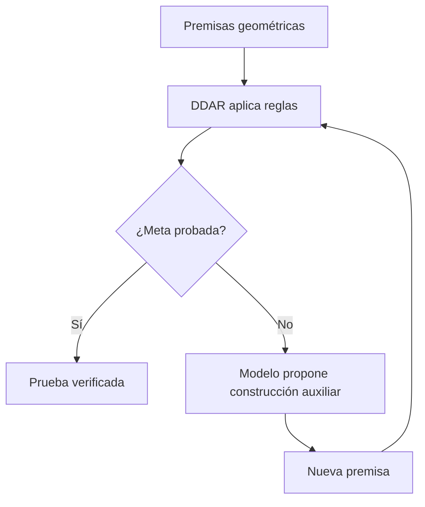

# 4. Sistemas concretos

Esta página conecta la teoría con arquitecturas reales. La idea no es memorizar
nombres de papers, sino reconocer el patrón que cada sistema representa.

## Vista rápida

| Sistema | Tipo Kautz | Qué hace el componente neuronal | Qué hace el componente simbólico | Riesgo principal |
|---|---|---|---|---|
| LLM+P | Tipo 4 | Traduce lenguaje natural a PDDL. | Fast Downward planifica. | Dominio PDDL debe existir. |
| DUPLEX | Tipo 4 | Extrae información guiada por esquema. | Mapper + planificador validan. | Omisiones semánticas. |
| Logic-LM | Tipo 4 | Formaliza y repara fórmulas. | Z3, Prover9 o Pyke razonan. | Mala formalización inicial. |
| CEGIS | Híbrido funcional | Propone candidatos y los repara. | SMT encuentra contraejemplos. | Especificación formal necesaria. |
| AlphaGeometry2 | Tipo 2 | Propone construcciones auxiliares. | DDAR prueba y verifica. | Dominio estrecho. |
| NELLIE | Híbrido de pruebas | Recupera/genera reglas en lenguaje natural. | Backward chaining estructura la prueba. | Unificación semántica ruidosa. |

!!! note "Rigor taxonómico"
    Esta tabla mezcla clasificación Kautz y rol funcional. Eso es deliberado,
    pero debe leerse con cuidado: LLM+P, DUPLEX y Logic-LM son Tipo 4; AG2 es
    Tipo 2; CEGIS y NELLIE se describen aquí principalmente por función porque
    su encaje taxonómico es menos directo.

## Resultados empíricos resumidos

| Sistema | Benchmark citado | Resultado principal |
|---|---|---|
| LLM+P | IPC-7 dominios de planificación | Mejora grande sobre LLM end-to-end, con éxitos aproximados de ~80-100% según dominio [8]. |
| Logic-LM | FOLIO / ProofWriter | GPT-4 + Logic-LM mejora frente a CoT puro, por ejemplo ~78.9% en FOLIO y ~83% en ProofWriter [9]. |
| AlphaGeometry2 | IMO Geometry 2000-2024 | 84% de problemas resueltos, 42/50, frente al 54% del AlphaGeometry original [15], [21]. |

Para más detalle y cautelas sobre estas cifras, revisa [Evidencia empírica](evidencia.md).

## Familia 1: planificación

### LLM+P

LLM+P parte de una observación práctica: los planificadores clásicos son muy
buenos encontrando planes, pero casi nadie escribe PDDL a mano. El LLM actúa
como traductor desde lenguaje natural al fichero de problema PDDL.

Lo fuerte de LLM+P es que separa claramente responsabilidades. Lo débil es que
asume que el dominio PDDL ya existe. Si el dominio no está escrito, el sistema
no resuelve el problema completo de modelado.

### DUPLEX

DUPLEX mejora el diseño de interfaz. En vez de pedir al LLM que escriba PDDL
libre, le pide que rellene una estructura guiada por esquema. Después un mapper
determinista convierte esa estructura en PDDL.

Esto reduce una clase importante de errores: paréntesis rotos, predicados
inventados o formatos inválidos. Pero no elimina el problema semántico: el LLM
puede omitir un objeto o malinterpretar una meta.

## Familia 2: lógica formal

### Logic-LM

Logic-LM formaliza problemas de razonamiento lógico y delega la inferencia a
solvers como Z3, Prover9, Pyke o `python-constraint`.

La parte didáctica importante: el self-refinement no convierte al LLM en un
razonador formal. Solo le da otra oportunidad para corregir la representación.
La garantía sigue viniendo del solver.

### CEGIS

CEGIS significa *Counterexample-Guided Inductive Synthesis*. El LLM propone una
solución candidata y un solver SMT intenta falsarla. Si encuentra un caso donde
falla, devuelve un contraejemplo concreto.

CEGIS tiene una señal de feedback más densa que un simple error de parser. El
contraejemplo dice exactamente dónde falla el candidato. Por eso suele ser más
útil para reparación que un mensaje genérico.

## Familia 3: búsqueda de pruebas

### AlphaGeometry2

AlphaGeometry2 es el caso más importante para no confundir taxonomía. No es un
pipeline donde el LLM formaliza y luego un solver resuelve. Es un sistema donde
el motor simbólico DDAR conserva el control y el modelo neuronal propone
construcciones auxiliares cuando la prueba se bloquea.

Este patrón es `Symbolic[Neuro]`: generación neuronal, verificación simbólica.
El modelo puede sugerir una construcción útil, pero no decide si la prueba es
válida.

### NELLIE

NELLIE construye árboles de prueba sobre lenguaje natural científico. Usa una
búsqueda tipo Prolog, pero los átomos pueden ser frases en lenguaje natural y la
unificación se apoya en modelos neuronales de inferencia semántica.

Esto lo hace más general que AlphaGeometry2, pero menos sound. Cuando la
unificación depende de similitud semántica, entra ruido donde Prolog clásico
tendría símbolos exactos.

## Comparación funcional

La comparación funcional permite distinguir qué problema resuelve cada familia,
qué papel asume el componente neuronal y qué garantía aporta el componente
simbólico:

| Pregunta | LLM+P / DUPLEX | Logic-LM / CEGIS | AlphaGeometry2 / NELLIE |
|---|---|---|---|
| ¿Qué problema resuelven? | Planificación. | Razonamiento lógico o síntesis. | Búsqueda de pruebas. |
| ¿Qué aporta el LLM? | Formalización. | Formalización o reparación. | Heurística o reglas candidatas. |
| ¿Qué aporta lo simbólico? | Plan válido. | Prueba, modelo o contraejemplo. | Cierre deductivo o árbol de prueba. |
| ¿Qué falla más? | Traducción de metas. | Formalización inicial. | Explosión de búsqueda. |

## Próximo capítulo

Ahora lee [Evidencia empírica](evidencia.md). Ahí se separan los claims
verificables de las interpretaciones pedagógicas.
