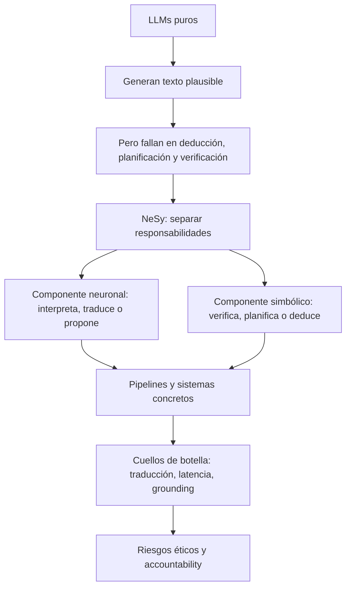

# Ruta guiada de lectura

Esta wiki se entiende mejor como una historia técnica, no como una colección de
fichas aisladas. La ruta recomendada va de la intuición al análisis crítico:
primero el problema, después la taxonomía, luego los pipelines, después los
sistemas concretos y finalmente las limitaciones éticas y arquitectónicas.

!!! tip "Cómo leerla"
    Si tienes poco tiempo, lee solo esta ruta guiada. Si necesitas preparar una
    exposición o defender el trabajo, usa después las páginas de referencia para
    profundizar en sistemas, técnicas y benchmarks concretos.

## Camino principal

  <a class="path-step" href="conceptos/">
    <strong>1. Conceptos base</strong>
    Qué intenta arreglar NeSy y por qué los LLMs solos no bastan.
  </a>
  <a class="path-step" href="taxonomia/">
    <strong>2. Taxonomía de Kautz</strong>
    Cómo clasificar arquitecturas sin confundir pipelines con heurísticas.
  </a>
  <a class="path-step" href="pipelines/">
    <strong>3. Pipelines NeSy-LLM</strong>
    El patrón común: traducir, formalizar, resolver, verificar y reparar.
  </a>
  <a class="path-step" href="casos/">
    <strong>4. Sistemas concretos</strong>
    LLM+P, DUPLEX, Logic-LM, CEGIS, AlphaGeometry2 y NELLIE.
  </a>
  <a class="path-step" href="evidencia/">
    <strong>5. Evidencia empírica</strong>
    Cifras, benchmarks, latencias y claims verificables del merged.
  </a>
  <a class="path-step" href="fragilidad/">
    <strong>6. Fragilidad</strong>
    Latencia, errores de traducción y trade-off entre soundness y generalidad.
  </a>
  <a class="path-step" href="etica/">
    <strong>7. Ética y accountability</strong>
    Sesgos híbridos, explicabilidad parcial y falsa sensación de rigor.
  </a>

## Mapa mental

## Qué deberías poder explicar al final

Después de leer la ruta, deberías poder responder con seguridad:

1. Por qué un LLM con *chain-of-thought* no equivale a un razonador formal.
2. Qué significa que AlphaGeometry2 sea Tipo 2 `Symbolic[Neuro]`.
3. Por qué LLM+P, DUPLEX y Logic-LM son principalmente pipelines Tipo 4.
4. Qué evidencia empírica apoya la mejora de pipelines como LLM+P o Logic-LM.
5. Dónde aparece el error más peligroso: no en el solver, sino en la traducción.
6. Por qué una prueba simbólica puede ser válida y aun así partir de premisas malas.

## Modo de uso según objetivo

| Objetivo | Ruta recomendada |
|---|---|
| Entender la idea para clase | Lee los capítulos 1, 2 y 3. |
| Preparar exposición oral | Lee toda la ruta y revisa [Evidencia empírica](evidencia.md). |
| Defender AlphaGeometry2 | Lee capítulos 2, 4 y la ficha [AlphaGeometry2](../sistemas/alphageometry2.md). |
| Criticar la arquitectura | Lee capítulos 5, 6 y 7, más [Fragilidad de traducción](../analisis-critico/fragilidad-traduccion.md). |
| Revisar bibliografía | Ve a [Bibliografía](../bibliografia.md). |

## Siguiente paso

Empieza por [Conceptos base](conceptos.md). Ahí se fija la idea más importante
de toda la wiki: NeSy no consiste en poner un solver al lado de un LLM, sino en
diseñar una interfaz donde cada componente haga aquello para lo que es fiable.
