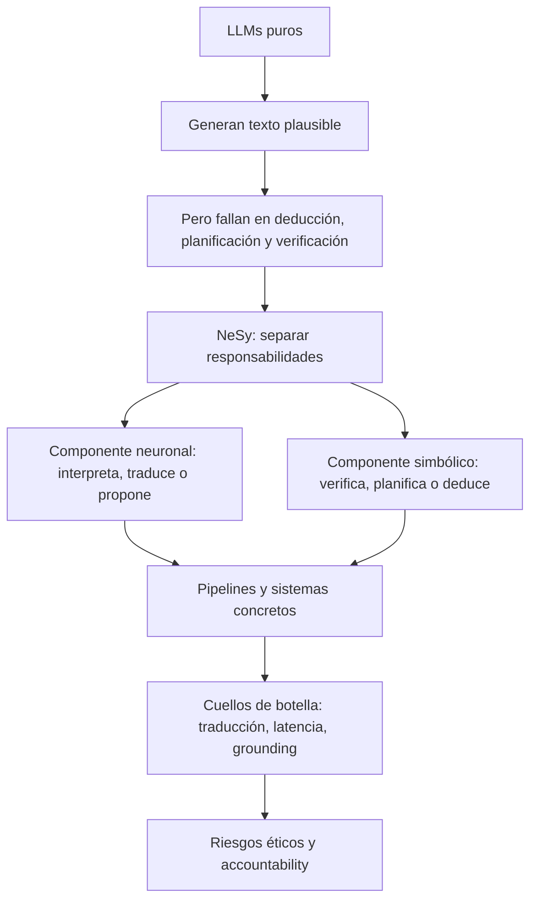

# Ruta guiada de lectura

Esta wiki se entiende mejor como una historia técnica, no como una colección de
fichas aisladas. La ruta recomendada va de la intuición al análisis crítico:
primero el problema, después la taxonomía, luego los pipelines, después los
sistemas concretos y finalmente las limitaciones éticas y arquitectónicas.

!!! tip "Cómo leerla"
    La ruta guiada funciona como lectura principal. Las páginas de referencia
    amplían sistemas, técnicas, benchmarks y conceptos específicos.

## Camino principal

  <a class="path-step" href="conceptos/">
    <strong>1. Conceptos base</strong>
    Qué intenta arreglar NeSy y por qué los LLMs solos no bastan.
  </a>
  <a class="path-step" href="taxonomia/">
    <strong>2. Taxonomía de Kautz</strong>
    Cómo clasificar arquitecturas sin confundir pipelines con heurísticas.
  </a>
  <a class="path-step" href="pipelines/">
    <strong>3. Pipelines NeSy-LLM</strong>
    El patrón común: traducir, formalizar, resolver, verificar y reparar.
  </a>
  <a class="path-step" href="casos/">
    <strong>4. Sistemas concretos</strong>
    LLM+P, DUPLEX, Logic-LM, CEGIS, AlphaGeometry2 y NELLIE.
  </a>
  <a class="path-step" href="evidencia/">
    <strong>5. Evidencia empírica</strong>
    Cifras, benchmarks, latencias y afirmaciones verificables.
  </a>
  <a class="path-step" href="fragilidad/">
    <strong>6. Fragilidad</strong>
    Latencia, errores de traducción y trade-off entre soundness y generalidad.
  </a>
  <a class="path-step" href="etica/">
    <strong>7. Ética y accountability</strong>
    Sesgos híbridos, explicabilidad parcial y falsa sensación de rigor.
  </a>

## Mapa mental

## Resultados de aprendizaje

Después de leer la ruta, el lector debería poder:

1. Distinguir un LLM con *chain-of-thought* de un razonador formal.
2. Explicar por qué AlphaGeometry2 es Tipo 2 `Symbolic[Neuro]`.
3. Identificar LLM+P, DUPLEX y Logic-LM como pipelines principalmente Tipo 4.
4. Relacionar los sistemas NeSy-LLM con sus resultados empíricos.
5. Localizar la fragilidad principal en la interfaz de traducción.
6. Reconocer que una prueba simbólica puede ser válida y aun así partir de premisas defectuosas.

## Recorridos de lectura

| Recorrido | Páginas recomendadas |
|---|---|
| Lectura conceptual | Capítulos 1, 2 y 3. |
| Lectura completa | Toda la ruta guiada y [Evidencia empírica](evidencia.md). |
| AlphaGeometry2 | Capítulos 2, 4 y ficha [AlphaGeometry2](../sistemas/alphageometry2.md). |
| Análisis crítico | Capítulos 5, 6 y 7, más [Fragilidad de traducción](../analisis-critico/fragilidad-traduccion.md). |
| Fuentes académicas | [Bibliografía](../bibliografia.md). |

## Siguiente paso

Empieza por [Conceptos base](conceptos.md). Ahí se fija la idea más importante
de toda la wiki: NeSy no consiste en poner un solver al lado de un LLM, sino en
diseñar una interfaz donde cada componente haga aquello para lo que es fiable.
