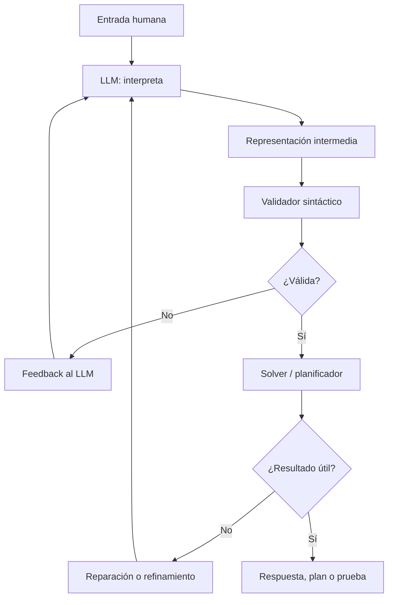
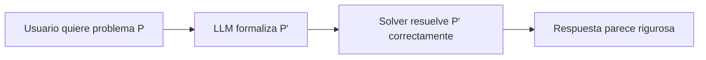

# 3. Pipelines NeSy-LLM

Un pipeline NeSy-LLM moderno suele tener una estructura repetida: el usuario
escribe en lenguaje natural, el LLM produce una representación estructurada, un
solver razona sobre ella y el resultado vuelve a lenguaje natural. La dificultad
no está en llamar a un solver, sino en construir una interfaz robusta entre el
texto y el formalismo.

Este patrón corresponde principalmente al Tipo 4 de Kautz (`Neuro -> Symbolic`)
y se ejemplifica con LLM+P [8], Logic-LM [9] y DUPLEX [14]. No debe confundirse
con AlphaGeometry2, que es Tipo 2 porque el solver simbólico conserva el control
de la búsqueda [15].

## Patrón general



## Las cinco etapas

### 1. Interpretación

El LLM lee lenguaje natural. Esta es la parte donde es fuerte: resolver
ambigüedad, detectar entidades, inferir relaciones expresadas de forma
informal.

Ejemplo:

> "Mueve la caja A de la habitación 1 a la habitación 2."

El modelo debe identificar objetos, localizaciones, estado inicial y objetivo.

### 2. Formalización

El sistema transforma la interpretación en algo que un solver pueda leer:
PDDL, FOL, SMT-LIB, JSON tipado o reglas lógicas.

```json
{
  "objects": ["robot", "box_A", "room_1", "room_2"],
  "initial_state": ["robot_at(room_1)", "box_at(box_A, room_1)"],
  "goal_state": ["box_at(box_A, room_2)"]
}
```

La decisión de diseño crucial es si el LLM escribe directamente el formalismo o
si rellena una estructura limitada que luego un mapper determinista convierte.
DUPLEX prefiere la segunda opción para reducir errores sintácticos.

### 3. Validación

Antes de razonar, conviene comprobar:

- que la sintaxis es válida;
- que los predicados existen;
- que los tipos coinciden;
- que no faltan objetos;
- que la meta puede expresarse dentro del dominio.

Esta etapa detecta errores baratos antes de invocar un solver caro.

### 4. Razonamiento simbólico

El solver ejecuta la parte formal:

| Tarea | Herramienta típica | Resultado |
|---|---|---|
| Planificación | Fast Downward | Secuencia de acciones |
| Lógica formal | Prover9, Z3 | Verdad, contradicción o prueba |
| Síntesis | Z3 en bucle CEGIS | Programa candidato o contraejemplo |
| Geometría | DDAR | Cierre deductivo y prueba |

### 5. Reparación y verbalización

Si el solver falla, su error se reinyecta al LLM. Si tiene éxito, el LLM puede
verbalizar la respuesta. Esta verbalización debe ser secundaria: la autoridad
debe venir del solver, no del estilo persuasivo del modelo.

## Tres diseños de interfaz

| Diseño | Ventaja | Riesgo |
|---|---|---|
| LLM escribe PDDL/FOL directamente | Flexible y rápido de prototipar. | Alta fragilidad sintáctica. |
| LLM rellena JSON o schema | Menos alucinación estructural. | Requiere ingeniería por dominio. |
| LLM propone hipótesis a un solver controlador | Mantiene soundness del motor simbólico. | Puede explotar la búsqueda. |

## Qué hace que un pipeline sea bueno

Un buen pipeline no intenta que el LLM sea perfecto. Diseña barreras:

1. **Vocabulario cerrado:** el modelo solo puede usar predicados permitidos.
2. **Tipos explícitos:** cada objeto tiene una clase.
3. **Validación temprana:** se detectan errores antes del solver.
4. **Feedback útil:** el solver devuelve errores concretos, no solo "falló".
5. **Presupuesto de iteraciones:** el sistema no refina indefinidamente.
6. **Trazabilidad:** se guarda qué premisas, reglas y pasos produjeron la salida.

Esta intuición coincide con el marco LLM-Modulo [19]: los LLMs pueden ayudar a
planificar, pero no deberían ser el módulo que garantiza validez. La garantía
debe salir de verificadores, compiladores, planificadores o solvers externos.

## Modo de fallo más peligroso

El fallo más visible es una sintaxis rota. Pero el fallo más peligroso es una
traducción semánticamente desviada:



Aquí el sistema no falla de forma ruidosa. Produce una salida válida para el
problema equivocado. Esa es la raíz de muchos riesgos discutidos en la parte
crítica de la wiki.

## Criterios de análisis

Para analizar un sistema NeSy-LLM, conviene aplicar esta plantilla:

| Pregunta | Respuesta que debes buscar |
|---|---|
| ¿Qué entra al sistema? | Lenguaje natural, problema formal, imagen, grafo. |
| ¿Qué produce el LLM? | PDDL, FOL, JSON, hipótesis, construcción auxiliar. |
| ¿Qué componente verifica? | Z3, Fast Downward, DDAR, Prover9, validador. |
| ¿Qué pasa si falla? | Self-refinement, contraejemplo, timeout, rechazo. |
| ¿Qué garantía queda? | Plan válido, prueba formal, consistencia parcial. |

## Próximo capítulo

Sigue con [Sistemas concretos](casos.md), donde este patrón se aplica a LLM+P,
DUPLEX, Logic-LM, CEGIS, AlphaGeometry2 y NELLIE.
