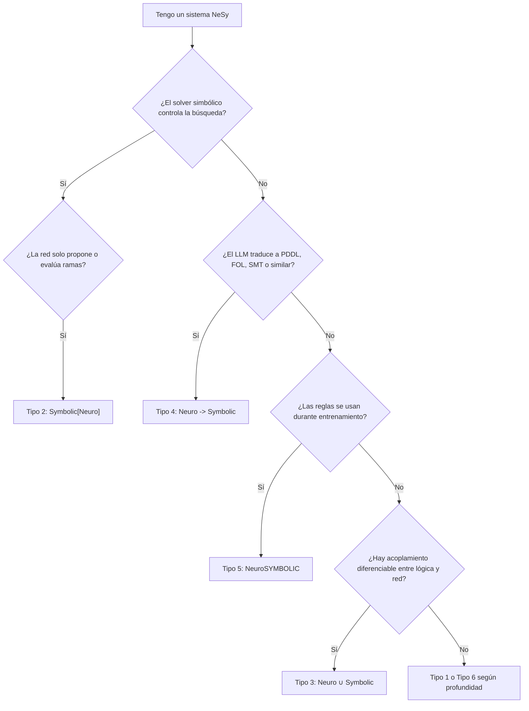
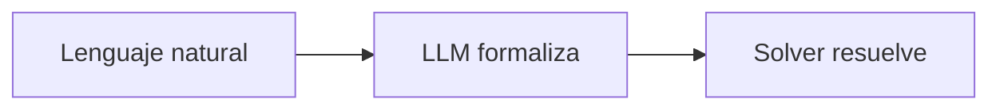
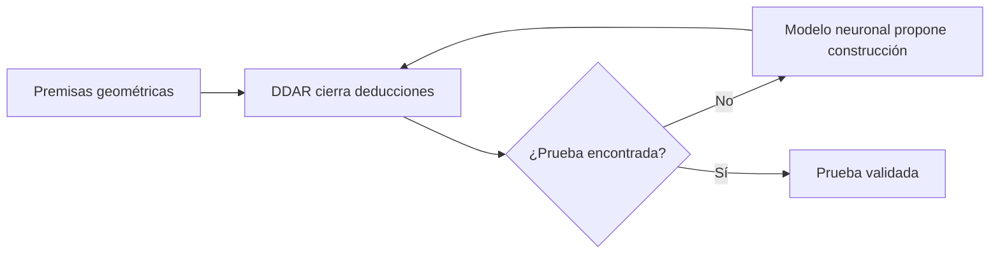

# 2. Taxonomía de Kautz

La taxonomía de Kautz sirve para ordenar las formas en que lo neuronal y lo
simbólico pueden acoplarse. Es útil porque evita decir simplemente "esto mezcla
LLMs con lógica". La pregunta real es: ¿quién controla el proceso?, ¿dónde está
el conocimiento simbólico?, ¿cuándo aparece el solver?

Esta wiki adopta Kautz [7] porque es pedagógicamente claro y se mapea bien al
ecosistema LLM. Aun así, no es la única taxonomía posible: otros autores
organizan NeSy por dirección del flujo o por el lugar donde vive la
representación de conocimiento [5].

!!! tip "Regla rápida"
    Para clasificar un sistema, primero identifica el componente que gobierna la
    búsqueda o la inferencia. Después pregunta si la red neuronal traduce,
    propone, aprende restricciones o forma parte interna del razonador.

## Los seis tipos en una tabla

| Tipo | Nombre | Pregunta diagnóstica | Ejemplo en la wiki |
|---|---|---|---|
| 1 | `Symbolic Neuro Symbolic` | ¿Entra texto, pasa por una red y sale texto? | LLM vanilla |
| 2 | `Symbolic[Neuro]` | ¿Un solver simbólico manda y llama a una red como heurística? | AlphaGeometry2 |
| 3 | `Neuro ∪ Symbolic` | ¿Hay bucle bidireccional y aprendizaje guiado por inferencia lógica? | DeepProbLog |
| 4 | `Neuro -> Symbolic` | ¿El LLM traduce a formalismo y luego razona un solver? | LLM+P, Logic-LM, DUPLEX |
| 5 | `NeuroSYMBOLIC` | ¿Las reglas entran en la pérdida o entrenamiento? | Semantic Loss, LTN |
| 6 | `Neuro[Symbolic]` | ¿El razonamiento simbólico está incrustado dentro de la arquitectura? | Horizonte teórico |

!!! note "Matiz de rigor"
    La frontera entre Tipo 5 y Tipo 6 no es completamente estable en la
    literatura. Por ejemplo, Logical Neural Networks pueden leerse como reglas
    integradas durante entrenamiento o como arquitectura con correspondencia
    lógica interna [11]. El matiz importante es que ningún LLM actual demuestra
    razonamiento combinatorio intrínseco y escalable de Tipo 6.

## Árbol de decisión

## El punto donde suele haber confusión

AlphaGeometry2 parece, a primera vista, un sistema donde un modelo neuronal
ayuda a resolver un problema formal. Eso podría sonar a Tipo 4, pero no lo es.
La diferencia es el control.

En un sistema Tipo 4:

En AlphaGeometry2:

DDAR gobierna. El modelo neuronal no traduce el problema ni certifica la prueba;
solo propone construcciones auxiliares. Por eso encaja en Tipo 2
`Symbolic[Neuro]`.

## Taxonomía frente a rol funcional

Una misma descripción informal puede mezclar dos planos:

| Plano | Pregunta | Ejemplo |
|---|---|---|
| Taxonómico | ¿Qué arquitectura es según Kautz? | AlphaGeometry2 es Tipo 2. |
| Funcional | ¿Qué papel juega el LLM? | En AlphaGeometry2 actúa como heurística. |

Esta distinción es importante para escribir con precisión. Decir "el LLM guía
la búsqueda" describe un rol funcional. Decir "Tipo 2" describe la topología.

## Qué tipos importan más para LLMs

Los LLMs actuales aparecen sobre todo en tres patrones:

- **Tipo 1:** LLM puro. Entrada textual, salida textual, sin verificación.
- **Tipo 4:** LLM como traductor a lenguaje formal. Es el patrón más común en
  Logic-LM, LLM+P y DUPLEX.
- **Tipo 2:** solver simbólico con red como heurística. Es el caso clave para
  AlphaGeometry2.

Los tipos 3, 5 y 6 son muy importantes teóricamente, pero escalan peor o están
menos demostrados con LLMs frontera.

En particular, DeepProbLog [23] es un ejemplo canónico de Tipo 3 con inferencia
lógico-probabilística diferenciable, pero la evidencia publicada opera con redes
mucho más pequeñas que los LLMs frontera. Semantic Loss [13], LTNs [10] y LNNs
[11] ilustran Tipo 5/6, pero todavía no hay demostración end-to-end a escala
LLM de miles de millones de parámetros.

## Mini-ejercicio

Clasifica estos sistemas:

| Sistema | Pista | Clasificación esperada |
|---|---|---|
| ChatGPT con chain-of-thought | No hay solver externo. | Tipo 1 |
| LLM+P | LLM genera PDDL, Fast Downward planifica. | Tipo 4 |
| Logic-LM | LLM formaliza, Prover9/Z3 razona. | Tipo 4 |
| AlphaGeometry2 | DDAR controla, Gemini propone construcciones. | Tipo 2 |
| Semantic Loss | Reglas en la función de pérdida. | Tipo 5 |

## Próximo capítulo

Sigue con [Pipelines NeSy-LLM](pipelines.md). Ahí verás cómo se implementa en la
práctica el patrón dominante: LLM como interfaz, solver como razonador.
