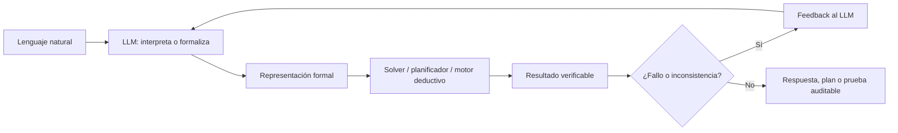

<section class="nesy-hero">
  
Wiki didáctica · IA Neurosimbólica · LLMs

  <h1>IA Neurosimbólica + LLMs</h1>
  

    Una guía para entender cómo los modelos de lenguaje pueden trabajar con
    solvers, planificadores y motores deductivos sin confundir texto plausible
    con razonamiento formal.
  

  

    <a class="nesy-button primary" href="guia/">Seguir la ruta guiada</a>
    <a class="nesy-button" href="guia/conceptos/">Leer conceptos base</a>
    <a class="nesy-button" href="guia/casos/">Ver sistemas concretos</a>
  

</section>

!!! tip "La tesis de la wiki"
    Un LLM es útil para interpretar, traducir o proponer. Un sistema simbólico
    es útil para verificar, planificar o deducir. La IA neurosimbólica funciona
    cuando esa división de responsabilidades está diseñada con cuidado.

  

    <strong>6</strong>
    tipos de Kautz explicados con ejemplos y errores frecuentes
  

  

    <strong>3</strong>
    familias de sistemas: planificación, lógica y búsqueda de pruebas
  

  

    <strong>1</strong>
    pregunta crítica: ¿el solver resolvió el problema correcto?
  

## Lee esto como un recorrido

  <a class="path-step" href="guia/conceptos/">
    <strong>1. Conceptos base</strong>
    LLMs, sistemas simbólicos, grounding y Sistema 1/Sistema 2.
  </a>
  <a class="path-step" href="guia/taxonomia/">
    <strong>2. Taxonomía</strong>
    Los seis tipos de Kautz y la trampa de AlphaGeometry2.
  </a>
  <a class="path-step" href="guia/pipelines/">
    <strong>3. Pipelines</strong>
    Cómo se pasa de lenguaje natural a PDDL, FOL, SMT o pruebas.
  </a>
  <a class="path-step" href="guia/casos/">
    <strong>4. Sistemas reales</strong>
    LLM+P, DUPLEX, Logic-LM, CEGIS, AlphaGeometry2 y NELLIE.
  </a>
  <a class="path-step" href="guia/evidencia/">
    <strong>5. Evidencia</strong>
    Resultados de PlanBench, Logic-LM, LLM+P y AlphaGeometry2.
  </a>
  <a class="path-step" href="guia/fragilidad/">
    <strong>6. Crítica técnica</strong>
    Traducción frágil, latencia y trade-off soundness/generalidad.
  </a>
  <a class="path-step" href="guia/etica/">
    <strong>7. Ética</strong>
    Sesgo híbrido, explainability laundering y accountability parcial.
  </a>

## La idea en una figura

## Qué contiene cada zona

  <article class="nesy-card">
    <h3>Ruta guiada</h3>
    
Capítulos largos y didácticos. Úsala como lectura principal.

    <a href="guia/">Entrar a la ruta</a>
  </article>
  <article class="nesy-card">
    <h3>Sistemas</h3>
    
Fichas de arquitecturas concretas para consultar rápido.

    <a href="sistemas/alphageometry2/">Ver AlphaGeometry2</a>
  </article>
  <article class="nesy-card">
    <h3>Referencia</h3>
    
Taxonomía, técnicas, benchmarks, comparativas y páginas de apoyo.

    <a href="taxonomia/kautz-overview/">Abrir referencia</a>
  </article>

## Si solo tienes diez minutos

1. Lee [Conceptos base](guia/conceptos.md).
2. Mira la tabla de [Taxonomía](guia/taxonomia.md).
3. Lee la explicación de [AlphaGeometry2](guia/casos.md#alphageometry2).
4. Revisa [Evidencia empírica](guia/evidencia.md).
5. Termina con [Fragilidad y límites](guia/fragilidad.md).

## Material de consulta rápida

| Necesitas aclarar | Página |
|---|---|
| Vocabulario técnico | [Glosario](glosario.md) |
| Papers y fuentes | [Bibliografía](bibliografia.md) |
| Cifras del merged | [Evidencia empírica](guia/evidencia.md) |
| Diferencia LLM puro vs NeSy | [LLM vs NeSy](comparativas/llm-vs-nesy.md) |
| Por qué falla la interfaz | [Fragilidad de traducción](analisis-critico/fragilidad-traduccion.md) |
| Cómo clasificar AlphaGeometry2 | [Tipo 2](taxonomia/tipo-2.md) |
