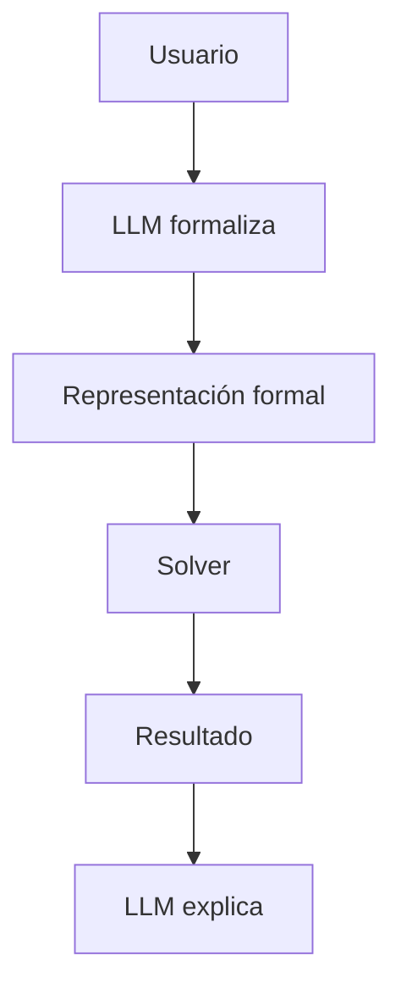

# Por qué NeSy importa en LLMs

!!! tip "TL;DR"
    Los LLMs han mejorado en razonamiento aparente, pero siguen fallando en
    planificación, deducción formal y consistencia. NeSy importa porque permite
    usar sus capacidades lingüísticas sin confiarles toda la inferencia.

## Fallas que motivan la integración

- Alucinaciones factuales.
- Errores en razonamiento multi-paso.
- Fragilidad ante cambios superficiales de vocabulario.
- Dificultad para mantener consistencia formal.
- Opacidad de los pesos y falta de trazas auditables.

## Qué aporta el componente simbólico

El solver no "opina": ejecuta reglas. Si recibe una formulación correcta,
devuelve una prueba, plan, modelo o contraejemplo verificable.

## Patrón dominante

## Ver también

- [LLM vs NeSy](../comparativas/llm-vs-nesy.md)
- [Logic-LM](../sistemas/logic-lm.md)
- [Fragilidad de traducción](../analisis-critico/fragilidad-traduccion.md)
