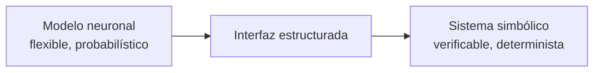

# ¿Qué es la IA neurosimbólica?

!!! tip "TL;DR"
    La IA neurosimbólica acopla modelos neuronales, fuertes en percepción y
    lenguaje natural, con sistemas simbólicos, fuertes en razonamiento formal.
    En LLMs, el patrón más útil es: el LLM traduce o propone; el solver verifica.

## El problema que resuelve

Los LLMs capturan regularidades estadísticas de lenguaje y pueden producir
respuestas plausibles, pero no garantizan consistencia lógica. Los sistemas
simbólicos, por el contrario, operan con reglas explícitas y pueden generar
pruebas, planes o contraejemplos verificables. Su debilidad es que necesitan una
entrada formal precisa.

La IA neurosimbólica intenta cerrar esa brecha:

## La hipótesis central

El LLM no debe razonar de extremo a extremo cuando la tarea exige garantías
formales. Debe actuar como interfaz semántica, extractor de información,
formalizador o proponente heurístico. El cálculo lógico queda delegado al
solver, planificador o motor deductivo.

## Tres roles del componente neuronal

| Rol | Ejemplo | Sistema |
|---|---|---|
| Formalizador | NL → PDDL / FOL / SMT | [LLM+P](../sistemas/llm-p.md), [Logic-LM](../sistemas/logic-lm.md) |
| Reparador | Error del solver → nueva formulación | [Logic-LM](../sistemas/logic-lm.md), [CEGIS](../sistemas/cegis.md) |
| Heurística | Proponer construcciones auxiliares | [AlphaGeometry2](../sistemas/alphageometry2.md) |

## Lo que NeSy no es

- No es solo *Chain-of-Thought*: CoT sigue siendo texto probabilístico.
- No es solo RAG: recuperar documentos no equivale a verificar inferencias.
- No es un ensemble superficial: la clave es separar responsabilidades.

## Ver también

- [Symbol grounding](symbol-grounding.md)
- [Sistema 1 / Sistema 2](sistema1-sistema2.md)
- [Taxonomía de Kautz](../taxonomia/kautz-overview.md)
- [Matriz funcional](../comparativas/matriz-funcional.md)
