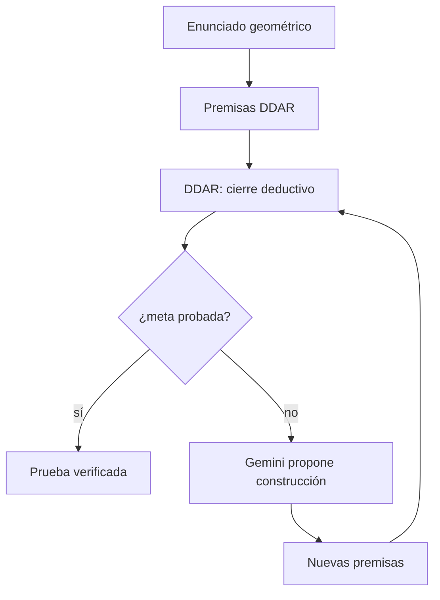

# AlphaGeometry2

**Año:** 2025  
**Tipo Kautz:** Tipo 2 (`Symbolic[Neuro]`)  
**Componente simbólico:** DDAR  
**Componente neuronal:** Gemini fine-tuneado como heurística  
**Paper:** Chervonyi et al., arXiv:2502.03544

!!! tip "TL;DR"
    AlphaGeometry2 resuelve geometría olímpica con un motor deductivo que manda
    y un modelo neuronal que propone construcciones auxiliares. El LLM no valida
    pruebas: DDAR las verifica.

## Problema que resuelve

Muchas pruebas geométricas requieren introducir puntos, líneas o círculos que no
aparecen en el enunciado. DDAR puede cerrar deductivamente lo derivable, pero no
inventar construcciones auxiliares. Ahí entra el modelo neuronal.

## Arquitectura

!!! note "La clasificación correcta"
    AlphaGeometry2 no es Tipo 4. Es Tipo 2 porque el solver simbólico conserva
    el control y consulta al modelo neuronal como heurística.

## Resultados

| Sistema | IMO Geometry 2000-2024 |
|---|---:|
| AlphaGeometry original | 54% |
| AlphaGeometry2 | 84% |

## Limitaciones

- Dominio estrecho: geometría euclidiana.
- Requiere lenguaje formal especializado.
- La búsqueda puede ser costosa.

## Ver también

- [Tipo 2](../taxonomia/tipo-2.md)
- [Construcciones auxiliares](../tecnicas/auxiliary-constructions.md)
- [IMO Geometry](../benchmarks/imo-geometry.md)
