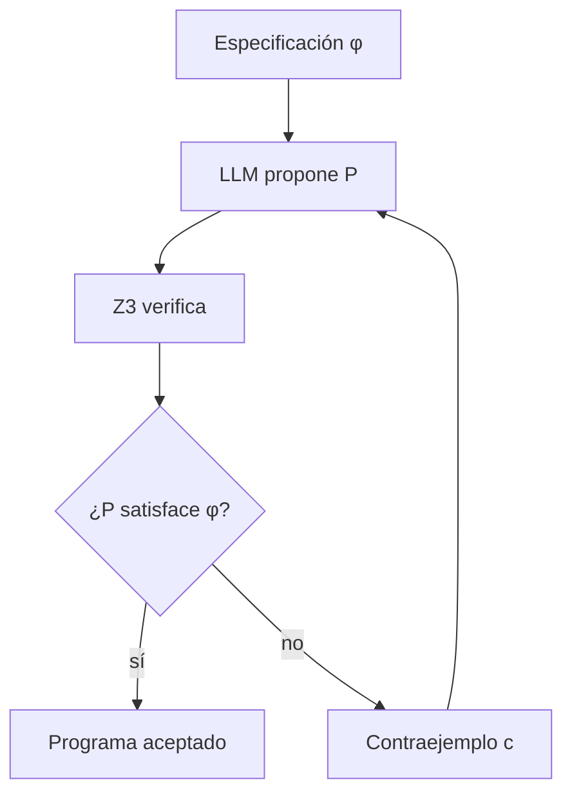

# CEGIS + LLM

**Año:** 2023  
**Tipo funcional:** generación neuronal + verificación SMT  
**Componente simbólico:** Z3  
**Paper:** Jha et al., MILCOM 2023

!!! tip "TL;DR"
    El LLM propone un programa candidato; Z3 lo verifica. Si falla, Z3 devuelve
    un contraejemplo concreto que guía la siguiente propuesta.

!!! note "Dónde encaja en la ruta"
    Lee esta ficha junto con [Logic-LM](logic-lm.md). La diferencia didáctica
    clave es la calidad del feedback: CEGIS devuelve contraejemplos concretos.

## Pipeline

## Por qué funciona

Un contraejemplo concreto es feedback denso. No dice solo "fallaste"; dice en
qué input falló el candidato.

## Cómo explicarlo en una frase

CEGIS permite que el LLM falle de forma útil: cada fallo produce un
contraejemplo que estrecha el espacio de soluciones posibles.

## Fortalezas

- No exige que el LLM acierte a la primera.
- Cada iteración elimina regiones del espacio de búsqueda.
- Produce candidatos verificables.

## Limitaciones

- Requiere especificación formal.
- Puede no converger antes del timeout.

## Ver también

- [Logic-LM vs CEGIS](../comparativas/logic-lm-vs-cegis.md)
- [SMT / Z3](../tecnicas/smt-solvers.md)
- [Self-refinement](../tecnicas/self-refinement.md)
