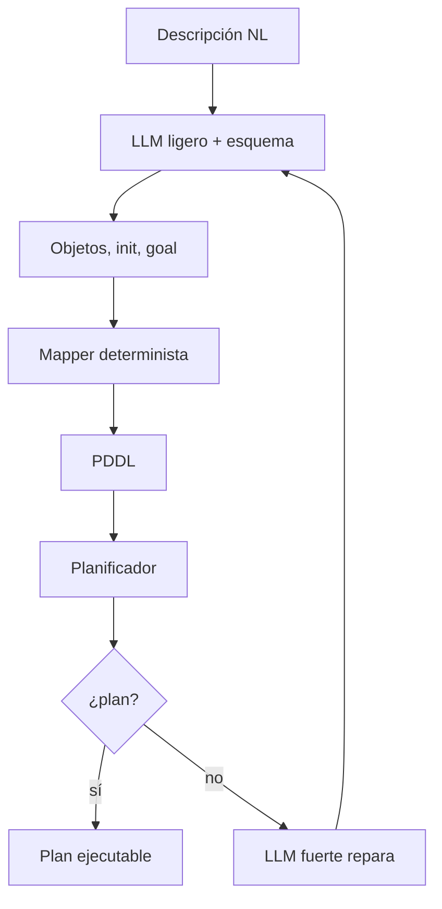

# DUPLEX

**Año:** 2026  
**Tipo Kautz:** Tipo 4 (`Neuro → Symbolic`)  
**Componente simbólico:** planificador clásico  
**Técnica clave:** schema-guided information extraction

!!! tip "TL;DR"
    DUPLEX reduce la generación libre de PDDL a extracción estructurada. El LLM
    rellena un esquema; un mapeador determinista produce PDDL; el planificador
    resuelve.

## Arquitectura

## Innovación

El sistema no pide al LLM que escriba PDDL libre. Lo restringe a campos
tipados. Esto elimina muchas alucinaciones sintácticas, aunque no todos los
errores semánticos.

## Fortalezas

- Menos errores de parseo que LLM+P.
- Separa semántica y sintaxis.
- Encaja bien con dominios cerrados.

## Limitaciones

- Requiere diseñar esquemas por dominio.
- Una extracción válida puede seguir siendo semánticamente equivocada.

## Ver también

- [Schema-guided IE](../tecnicas/schema-guided-ie.md)
- [LLM+P](llm-p.md)
- [Latencia](../analisis-critico/latencia.md)
