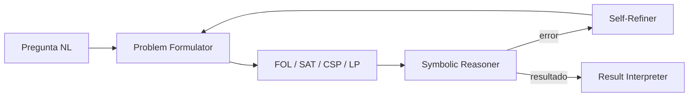

# Logic-LM

**Año:** 2023  
**Tipo Kautz:** Tipo 4 (`Neuro → Symbolic`)  
**Solvers:** Prover9, Z3, Pyke, python-constraint  
**Paper:** Pan et al., EMNLP Findings 2023

!!! tip "TL;DR"
    Logic-LM traduce problemas de razonamiento lógico a formalismos ejecutables
    y usa solvers externos. Si el solver falla, el error vuelve al LLM como
    señal de reparación.

!!! note "Dónde encaja en la ruta"
    Lee esta ficha después de [Sistemas concretos](../guia/casos.md). Logic-LM
    muestra el patrón Tipo 4 aplicado a lógica formal en vez de planificación.

## Arquitectura

## Formalismos

| Formalismo | Herramienta |
|---|---|
| First-Order Logic | Prover9 |
| SAT / SMT | Z3 |
| Logic Programming | Pyke |
| CSP | python-constraint |

## Limitación principal

Los mensajes de error suelen ser pobres: indican que algo falló, pero no siempre
explican qué premisa debe cambiarse.

## Cómo explicarlo en una frase

Logic-LM mejora el razonamiento lógico no porque el LLM razone mejor, sino
porque obliga a que la inferencia pase por un solver verificable.

## Ver también

- [Self-refinement](../tecnicas/self-refinement.md)
- [Logic-LM vs CEGIS](../comparativas/logic-lm-vs-cegis.md)
- [SMT / Z3](../tecnicas/smt-solvers.md)
