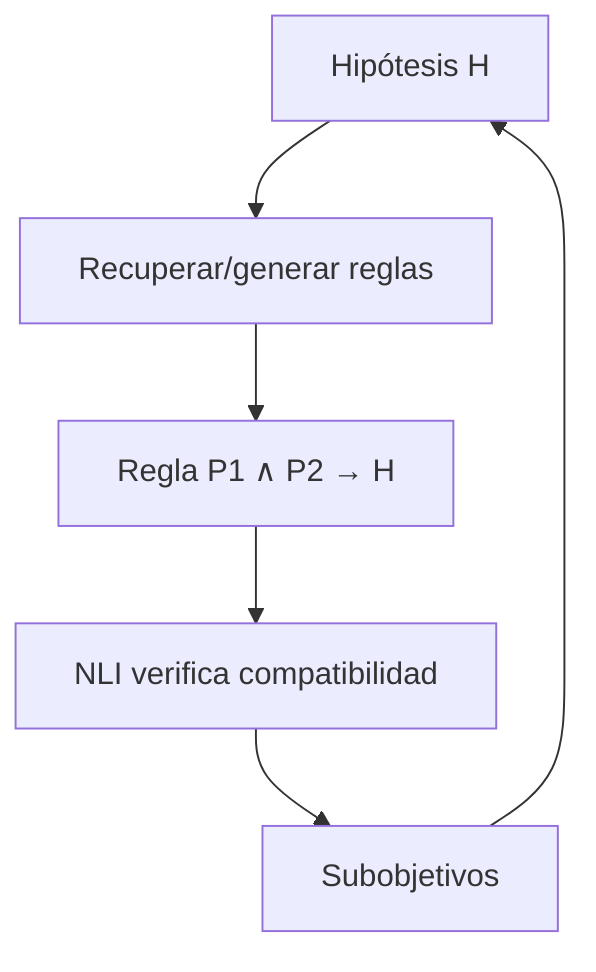

# NELLIE

**Año:** 2022  
**Tipo funcional:** búsqueda simbólica asistida por lenguaje natural  
**Técnica:** backward chaining neuro-simbólico  
**Paper:** Weir, Clark & Van Durme, arXiv:2209.07662

!!! tip "TL;DR"
    NELLIE construye árboles de prueba sobre frases en lenguaje natural. Usa
    backward chaining estilo Prolog, pero reemplaza la unificación sintáctica por
    unificación semántica vía NLI.

!!! note "Dónde encaja en la ruta"
    Lee esta ficha después de [Sistemas concretos](../guia/casos.md). NELLIE es
    útil para discutir el trade-off entre generalidad y garantías formales.

## Arquitectura

## Diferencia con Prolog clásico

En Prolog, los átomos son símbolos exactos. En NELLIE, los átomos son frases en
lenguaje natural. Esto aumenta generalidad, pero reduce soundness.

## Cómo explicarlo en una frase

NELLIE gana flexibilidad al razonar sobre lenguaje natural, pero paga esa
flexibilidad con una unificación semántica menos estricta que la lógica clásica.

## Fortalezas

- Produce árboles de prueba explícitos.
- Opera sobre lenguaje natural.
- Más flexible que sistemas geométricos cerrados.

## Limitaciones

- La unificación semántica introduce ruido.
- Menos sound que AlphaGeometry2.

## Ver también

- [AlphaGeometry2 vs NELLIE](../comparativas/alphageometry2-vs-nellie.md)
- [Soundness vs generalidad](../analisis-critico/trade-soundness-generalidad.md)
