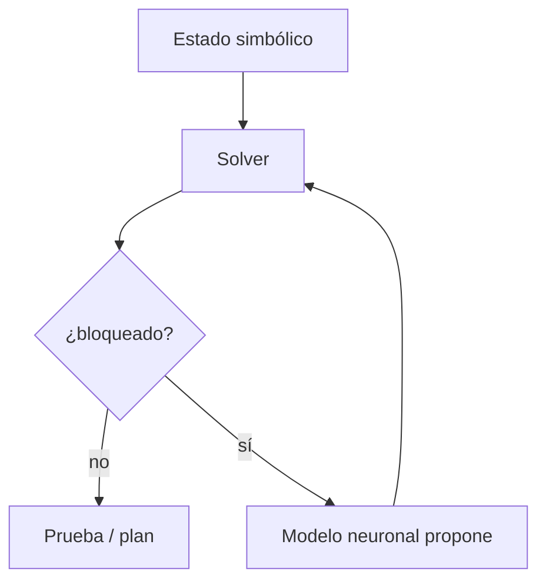

# Tipo 2: Symbolic[Neuro]

**Abreviación:** `Symbolic[Neuro]`  
**Direccionalidad:** solver simbólico con llamadas neuronales  
**Escalabilidad a LLMs:** viable en dominios cerrados

!!! tip "TL;DR"
    El sistema simbólico manda. El componente neuronal solo actúa como
    heurística, generador de candidatos o módulo de percepción. AlphaGeometry2
    es el ejemplo clave.

## Definición

Un motor simbólico controla la búsqueda o deducción y consulta a una red cuando
necesita estimar una rama, proponer una construcción o reconocer información
difícil de codificar manualmente.

## Ejemplo canónico

[AlphaGeometry2](../sistemas/alphageometry2.md): DDAR realiza el cierre
deductivo y Gemini fine-tuneado propone construcciones auxiliares.

## Fortalezas

- Alta soundness en el núcleo simbólico.
- Buen uso de heurísticas aprendidas.
- Trazas auditables cuando el solver verifica cada paso.

## Limitaciones

- Dominio estrecho.
- Coste alto si la red se consulta muchas veces.
- Requiere un lenguaje formal y motor simbólico ya diseñados.

## Ver también

- [AlphaGeometry2](../sistemas/alphageometry2.md)
- [Construcciones auxiliares](../tecnicas/auxiliary-constructions.md)
- [AlphaGeometry2 vs NELLIE](../comparativas/alphageometry2-vs-nellie.md)
