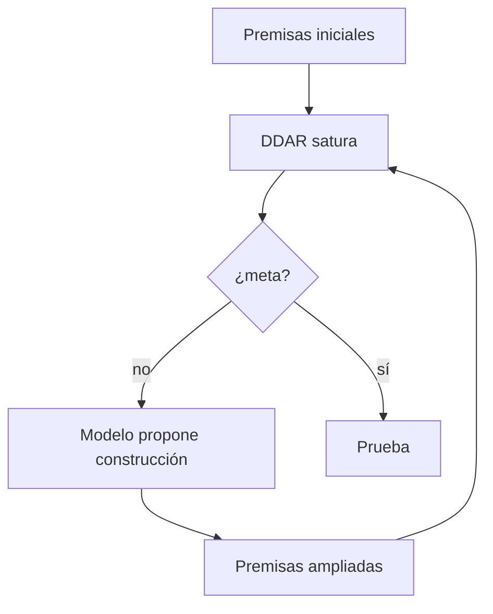

# Construcciones auxiliares

**Familia:** técnica de prueba geométrica  
**Usado por:** [AlphaGeometry2](../sistemas/alphageometry2.md)

!!! tip "TL;DR"
    Muchas pruebas geométricas requieren introducir objetos que no están en el
    enunciado. AlphaGeometry2 usa un modelo neuronal para proponer esas
    construcciones y DDAR para verificar si ayudan a cerrar la prueba.

## Ejemplo conceptual

Una prueba puede necesitar:

- un punto medio;
- una línea paralela;
- un círculo auxiliar;
- una intersección no mencionada.

## Pipeline

## Ver también

- [AlphaGeometry2](../sistemas/alphageometry2.md)
- [Tipo 2](../taxonomia/tipo-2.md)
- [IMO Geometry](../benchmarks/imo-geometry.md)
