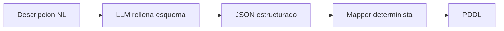

# Schema-guided Information Extraction

**Familia:** extracción estructurada  
**Usado por:** [DUPLEX](../sistemas/duplex.md)

!!! tip "TL;DR"
    En vez de pedir al LLM que escriba PDDL libre, se le pide rellenar campos
    tipados. Un mapeador determinista convierte esa estructura a PDDL.

## Idea

## Qué reduce

- Predicados inventados.
- Paréntesis o sintaxis PDDL corrupta.
- Variabilidad de formato.

## Qué no resuelve

Un JSON válido puede omitir una restricción importante. La forma correcta no
garantiza semántica correcta.

## Ver también

- [DUPLEX](../sistemas/duplex.md)
- [Fragilidad de traducción](../analisis-critico/fragilidad-traduccion.md)
