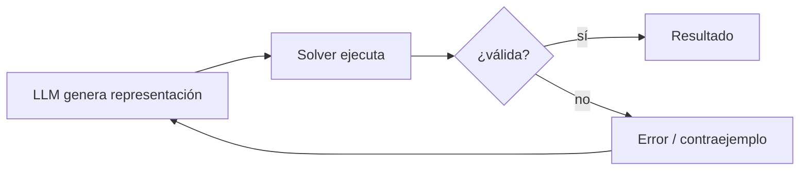

# Self-refinement

**Familia:** mecanismo de control  
**Usado por:** [Logic-LM](../sistemas/logic-lm.md), [DUPLEX](../sistemas/duplex.md), [CEGIS](../sistemas/cegis.md)

!!! tip "TL;DR"
    El solver devuelve un error, diagnóstico o contraejemplo. Esa señal se
    reinyecta al LLM para reparar la formulación. Mejora robustez, pero no
    garantiza convergencia.

## Bucle general

## Riesgos

- Oscilación entre formulaciones.
- Reparar sintaxis pero empeorar semántica.
- Aumentar latencia por rondas adicionales.

## Ver también

- [Logic-LM](../sistemas/logic-lm.md)
- [CEGIS](../sistemas/cegis.md)
- [Latencia](../analisis-critico/latencia.md)
