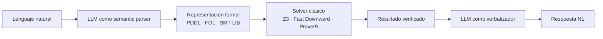
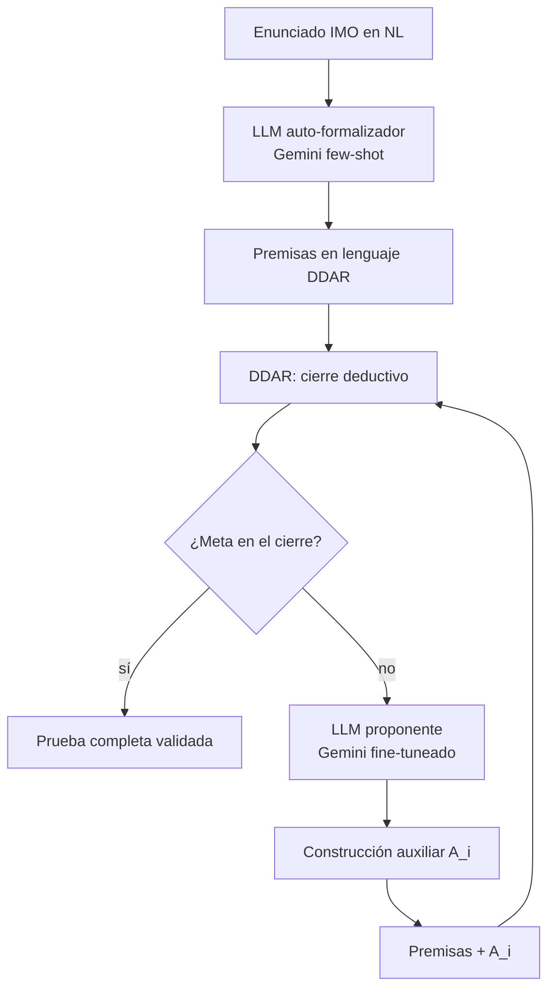
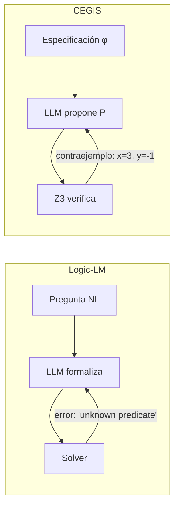

# Páginas de muestra

Tres páginas completas como referencia de estilo. Una de cada tipo principal:
**concepto**, **sistema**, **comparativa**. Si replicas este nivel de pulido y
brevedad, el resto de la wiki se escribe sola.

---

## Muestra 1 — Página-concepto: `taxonomia/tipo-4.md`

```markdown
# Tipo 4: Neuro → Symbolic

**Abreviación:** `Neuro → Symbolic`
**Direccionalidad:** unidireccional, en cascada
**Escalabilidad a LLMs:** ✅ paradigma dominante

!!! tip "TL;DR"
    El LLM traduce lenguaje natural a un lenguaje formal (PDDL, FOL, SMT-LIB)
    y un solver clásico ejecuta el razonamiento. Es el tipo más implementado
    en arquitecturas LLM-NeSy actuales — y el que tiene la fragilidad de
    traducción más documentada.

## Definición

En el Tipo 4 de [Kautz](kautz-overview.md), el componente neural opera
exclusivamente como **analizador semántico** (semantic parser). Recibe el
prompt en lenguaje natural y lo compila en una representación formal estricta
que se transfiere a un solver determinista. El solver ejecuta el razonamiento
sin intervención neuronal posterior.

## Pipeline conceptual



La **comunicación es unidireccional** desde el LLM al solver. Algunas variantes
(Logic-LM, DUPLEX) añaden un bucle de [self-refinement](../tecnicas/self-refinement.md)
que reinyecta errores del solver al LLM, pero la dirección dominante del flujo
sigue siendo `Neuro → Symbolic`.

## Ejemplo canónico

**[LLM+P](../sistemas/llm-p.md)** (Liu et al., 2023): el LLM traduce un problema
de planificación en NL a un problem file PDDL; Fast Downward genera el plan;
el LLM lo verbaliza de vuelta.

## Sistemas en este tipo

| Sistema | Lenguaje formal | Solver |
|---|---|---|
| [LLM+P](../sistemas/llm-p.md) | PDDL | Fast Downward |
| [DUPLEX](../sistemas/duplex.md) | PDDL (vía JSON Schema) | Fast Downward |
| [Logic-LM](../sistemas/logic-lm.md) | FOL · SAT · CSP · LP | Prover9 · Z3 · Pyke · python-constraint |
| [LINC](../sistemas/linc.md) | FOL | Theorem prover |
| [PAL](../sistemas/pal.md) | Python ejecutable | Intérprete Python |

## Fortalezas

- **Garantías formales en la fase de razonamiento.** Una vez el solver recibe
  un input válido, el resultado es matemáticamente verificable.
- **Reutiliza solvers maduros.** Z3, Fast Downward, Prover9 tienen décadas de
  optimización detrás.
- **Trazabilidad parcial.** El árbol de prueba simbólico es auditable, aunque
  las premisas del LLM no lo son (ver
  [explainability laundering](../etica/explainability-laundering.md)).

## Limitaciones

!!! warning "Fragilidad de traducción"
    Si el LLM omite una premisa, alucina un predicado o corrompe la sintaxis
    durante la extracción, el pipeline colapsa. El solver no tiene tolerancia
    a la ambigüedad. Ver [análisis detallado](../analisis-critico/fragilidad-traduccion.md).

- **Latencia acumulada.** Cada fallo de traducción dispara un nuevo prompt al
  LLM más una nueva ejecución del solver.
- **Dependencia de esquema previo.** El sistema necesita predicados, tipos y
  restricciones bien definidos antes de funcionar — frágil en dominios abiertos.
- **Soundness no transitiva.** El solver puede ser sound; el pipeline completo
  no, porque la traducción introduce ruido.

## Comparación con tipos adyacentes

**Diferencia con [Tipo 3](tipo-3.md):** el Tipo 3 tiene comunicación bidireccional
(el solver retropropaga gradiente al neural); el Tipo 4 no entrena al LLM con la
señal del solver, solo lo reprompta. Tipo 3 es más ambicioso teóricamente pero
no escala a LLMs.

**Diferencia con [Tipo 2](tipo-2.md):** en Tipo 2 el solver gobierna y llama al
neural como subrutina (AlphaGeometry2); en Tipo 4 el LLM produce la representación
y luego "se aparta" mientras el solver trabaja.

## Lecturas adicionales

- Kambhampati et al. 2024, [LLM-Modulo](../sistemas/llm-modulo.md): generaliza
  el patrón Tipo 4 con verificadores múltiples.
- Pan et al. 2023, Logic-LM (paper original): caracterización formal del pipeline
  de tres componentes.

## Ver también

- [¿Qué es la IA neurosimbólica?](../overview/que-es-nesy.md)
- [Self-refinement como técnica](../tecnicas/self-refinement.md)
- [Schema-guided IE](../tecnicas/schema-guided-ie.md)
- [Análisis crítico: fragilidad de traducción](../analisis-critico/fragilidad-traduccion.md)
```

---

## Muestra 2 — Página-sistema: `sistemas/alphageometry2.md`

```markdown
# AlphaGeometry2

**Año:** 2025 (paper Feb 2025; sistema usado en IMO 2024)
**Autores:** Chervonyi, Trinh, Olšák et al. (Google DeepMind)
**Tipo Kautz:** Tipo 2 (`Symbolic[Neuro]`)
**Componente simbólico:** DDAR (motor deductivo, C++)
**Componente neuronal:** Gemini fine-tuneado (~150M-3.3B parámetros)
**Paper:** [arXiv:2502.03544](https://arxiv.org/abs/2502.03544)

!!! tip "TL;DR"
    AlphaGeometry2 resuelve el 84% de los problemas de geometría IMO
    2000-2024 (42 de 50), superando al medallista de oro promedio.
    Lo hace con un motor simbólico clásico (DDAR) que conduce la búsqueda
    y un Gemini fine-tuneado que propone construcciones auxiliares cuando
    DDAR se atasca. Los LLMs frontera (o1, Gemini Thinking) solos resuelven
    cero de esos problemas.

## Problema que resuelve

Los problemas de geometría olímpica requieren con frecuencia
**construcciones auxiliares** —puntos, líneas o círculos que no aparecen en
el enunciado pero son necesarios para la prueba. Un motor de
[forward chaining](../tecnicas/backward-chaining.md) puro como DDAR puede
cerrar deductivamente todo lo derivable de las premisas, pero no puede
inventar entidades nuevas. Ahí es donde entra el componente neuronal.

## Arquitectura



!!! note "Hay DOS LLMs en AG2, no uno"
    1. **Auto-formalizador:** Gemini con few-shot prompting que traduce el
       enunciado IMO al lenguaje DSL de DDAR. Uso clásico de
       [Tipo 4](../taxonomia/tipo-4.md).
    2. **Proponente de construcciones:** Gemini *fine-tuneado* sobre millones
       de teoremas sintéticos, usado como heurística dentro del bucle de
       búsqueda. Uso de [Tipo 2](../taxonomia/tipo-2.md).

    El sistema combina dos roles arquitectónicos del mismo tipo de modelo.

### Pasos

1. **Auto-formalización.** El LLM traduce el enunciado a proposiciones DDAR
   (`coll(A,B,C)`, `cong(AB, CD)`, etc.).
2. **Cierre deductivo inicial.** DDAR aplica todas las reglas hasta saturación.
   Si la meta aparece, la prueba termina.
3. **Proposición heurística.** Si no, el LLM propone una construcción auxiliar.
   La sampling es de alta temperatura (t=1.0, k=32 muestras) — la diversidad
   es esencial.
4. **SKEST: Shared Knowledge Ensemble of Search Trees.** Múltiples búsquedas
   paralelas comparten hechos derivados. Innovación clave de AG2 sobre AG1.
5. **Iteración.** El bucle continúa hasta encontrar prueba o agotar presupuesto.

## Ejemplo: IMO 2024 P4

> *"Sea ABC un triángulo con incentro I que satisface AB < AC < BC. Sea X
> un punto en la línea BC, distinto de C, tal que la línea por X paralela
> a AC sea tangente a la incírculo. Sea Y similar para B. (...)"*

AG2 resuelve este problema con una construcción auxiliar que el paper
caracteriza como mostrando "creatividad superhumana". El árbol de prueba
final es verificable paso a paso por DDAR — el LLM nunca afirma que la
prueba es válida.

## Resultados empíricos

| Sistema | IMO 2000-2024 (50 problemas) |
|---|---:|
| o1 / Gemini Thinking (LLMs frontera) | ~0% |
| AlphaGeometry original (AG1) | 54% |
| **AlphaGeometry2 (AG2)** | **84% (42/50)** |
| Medallista de oro IMO promedio | ~82% |

Mejoras específicas sobre AG1:

- **Lenguaje extendido:** cobertura del 66% al 88% de problemas IMO.
  Añade objetos en movimiento, ecuaciones lineales de ángulos/razones/distancias,
  problemas no constructivos.
- **Solver C++ reescrito:** dos órdenes de magnitud más rápido.
- **Gemini fine-tuneado** sustituye al transformer entrenado desde cero de AG1.
- **SKEST** permite knowledge sharing entre árboles de búsqueda paralelos.

En IMO 2024, AG2 fue parte de un sistema combinado que obtuvo medalla de plata
(28 puntos sobre 42; umbral de oro: 29).

## Fortalezas

- **Soundness fuerte.** El motor simbólico verifica cada paso; el LLM no puede
  alucinar una prueba inválida.
- **Trazabilidad completa.** El árbol de prueba es auditable.
- **Supera a humanos en su dominio.** Gold medalist promedio: ~82%; AG2: 84%.

## Limitaciones

- **Solo geometría euclidiana plana.** No transferible a otros dominios sin
  re-construcción del lenguaje DSL y del motor simbólico.
- **Latencia.** Una búsqueda IMO difícil ocupa minutos a horas. Inviable para
  uso interactivo.
- **Cobertura del lenguaje no es 100%.** El 12% restante de problemas IMO
  requiere objetos no expresables en el DSL actual.
- **Coste de entrenamiento.** El Gemini proponente se entrena sobre millones
  de teoremas sintéticos — solo accesible para laboratorios con recursos
  DeepMind-tier.

## ¿Es realmente un LLM?

Confusión frecuente: AG1 (2024) entrenaba un transformer **desde cero**, no
era un LLM en sentido estricto. AG2 (2025) usa **Gemini fine-tuneado** —
sí es un LLM por arquitectura y escala (hasta 3.3B parámetros). Lo que
diferencia AG2 de un LLM en *chat* no es la naturaleza del modelo, sino el
**rol arquitectónico**: el LLM aquí no responde, propone candidatos para
verificación simbólica.

## Implementación

Código no abierto. La arquitectura DDAR es derivada de los trabajos de
Trinh et al. 2024 (AG1, *Nature*), donde sí hay implementación open-source.

## Comparación con sistemas relacionados

- vs [NELLIE](nellie.md): NELLIE usa backward chaining y opera sobre lenguaje
  natural. Más general, menos sound. Ver
  [comparativa detallada](../comparativas/alphageometry2-vs-nellie.md).
- vs [LLM-Modulo](llm-modulo.md): LLM-Modulo trata al LLM como generador de
  candidatos completos verificados externamente; AG2 lo usa como proponente
  de pasos atómicos dentro de una búsqueda gobernada por el solver.

## Ver también

- [Tipo 2: Symbolic[Neuro]](../taxonomia/tipo-2.md)
- [Construcciones auxiliares como técnica](../tecnicas/auxiliary-constructions.md)
- [Benchmark IMO Geometry](../benchmarks/imo-geometry.md)
- [Trade-off soundness vs generalidad](../analisis-critico/trade-soundness-generalidad.md)
```

---

## Muestra 3 — Página-comparativa: `comparativas/logic-lm-vs-cegis.md`

```markdown
# Logic-LM vs CEGIS: la densidad del feedback

!!! tip "TL;DR"
    Ambos sistemas combinan LLM + solver formal con un bucle de reparación.
    La diferencia crítica no es el solver: es **qué información reciben de
    vuelta**. CEGIS recibe contraejemplos concretos (señal densa). Logic-LM
    recibe mensajes de error (señal pobre). CEGIS converge más rápido.

## Las dos arquitecturas en una imagen



## Tabla comparativa

| Aspecto | [Logic-LM](../sistemas/logic-lm.md) | [CEGIS](../sistemas/cegis.md) |
|---|---|---|
| **Tipo de tarea** | Razonamiento lógico (FOL, SAT, CSP, LP) | Síntesis de programas verificables |
| **Solver típico** | Prover9, Z3 (proposicional), Pyke, python-constraint | Z3 (SMT completo) |
| **Qué se reinyecta** | Mensaje de error textual del parser/solver | **Modelo concreto** (asignación de variables) que falsifica el candidato |
| **Densidad del feedback** | Baja: el LLM debe inferir qué premisa cambiar | Alta: el contraejemplo ancla la próxima iteración |
| **Convergencia típica** | Variable; puede oscilar | Rápida (típicamente pocas iteraciones) |
| **Requisito sobre el problema** | Formalizable en un formalismo soportado | Especificación φ formalizable manualmente en SMT-LIB |
| **Mejora reportada** | +4.86% (GPT-3.5) a +7.82% (GPT-4) por el bucle | Convergencia en pocas iteraciones sobre baseline sin verificación |
| **Fragilidad principal** | Error de formalización inicial; oscilación | Especificación φ debe estar bien formada |

## Por qué la densidad del feedback importa

### Logic-LM: feedback escaso

Cuando el solver de Logic-LM falla, el LLM recibe algo como:

```text
Z3 error: unknown predicate Profesional(x)
```

El LLM debe ahora inferir qué hacer. ¿El predicado no existe? ¿Es un typo?
¿Falta una declaración? El espacio de hipótesis es grande y la señal no
discrimina entre ellas.

### CEGIS: feedback rico

Cuando Z3 rechaza un candidato P de CEGIS, devuelve un **contraejemplo
concreto** — una asignación de valores donde P falla:

```text
Counterexample: x=3, y=-1, z=0
P(3, -1, 0) returned false; expected true.
```

El LLM ahora tiene un input específico que distingue su candidato del programa
correcto. La próxima iteración no parte del cero: parte de "tu programa anterior
falla en este caso, repáralo".

Solar-Lezama formalizó esta intuición en su tesis: cada contraejemplo elimina
una región concreta del espacio de candidatos. El espacio colapsa
exponencialmente. En contraste, un mensaje de error genérico no induce
contracción del espacio.

## ¿Cuándo usar cada uno?

**Usa Logic-LM cuando:**

- El problema es razonamiento lógico discreto (¿se sigue C de las premisas?).
- No hay una "función objetivo" que CEGIS pueda verificar punto a punto.
- Necesitas múltiples formalismos (FOL para algunos sub-problemas, CSP para otros).

**Usa CEGIS cuando:**

- El problema es síntesis: existe una especificación φ y buscas un programa P
  que la satisfaga.
- Z3 puede generar contraejemplos para tu φ.
- Tu dominio admite verificación constructiva (no solo binaria).

## Lo que ambos comparten

Ambos sistemas asumen el principio **"el LLM no necesita ser correcto al
primer intento"**. La integración con un solver permite tratar el LLM como
generador de candidatos cuya corrección se verifica externamente. La
diferencia está en cuán informativa es la señal de rechazo.

## Implicación de diseño

Si estás construyendo un sistema NeSy nuevo y tienes la opción de elegir
qué tipo de feedback reinyecta tu solver al LLM, **inviértelo en información
densa**. Un contraejemplo concreto vale más que diez mensajes de error
genéricos. Esta lección se generaliza a otros sistemas:

- [LLM-Modulo](../sistemas/llm-modulo.md) lo aplica con verificadores múltiples
  que cada uno produce diagnósticos específicos.
- [DUPLEX](../sistemas/duplex.md) lo aplica restringiendo la salida del LLM a
  un esquema, lo que hace que los errores que ocurren sean más localizables.

## Ver también

- [Self-refinement como técnica general](../tecnicas/self-refinement.md)
- [CEGIS pattern (algorítmico)](../tecnicas/cegis-pattern.md)
- [Tipo 4: Neuro → Symbolic](../taxonomia/tipo-4.md)
- [Sistema: Logic-LM](../sistemas/logic-lm.md)
- [Sistema: CEGIS](../sistemas/cegis.md)
```

---

## Notas de estilo evidentes en estas muestras

1. **TL;DR siempre arriba** en bloque admonition. El lector debe poder cerrar
   la pestaña en 10 segundos si no le sirve.
2. **Tablas para comparar; prosa para explicar; diagramas para mostrar flujo.**
   Nunca elegir formato por estética — siempre por información.
3. **Cross-links inline**, no solo al final. Cada vez que mencionas otro
   sistema/concepto, link directo.
4. **Admonitions como "warning" y "note"** para resaltar fricciones (riesgos,
   confusiones frecuentes, casos edge).
5. **Bloques de código incluso para ejemplos textuales** —
   `Z3 error: ...` va en bloque de código, no en cursiva.
6. **Sección final "Ver también"** obligatoria. 4-6 enlaces salientes.